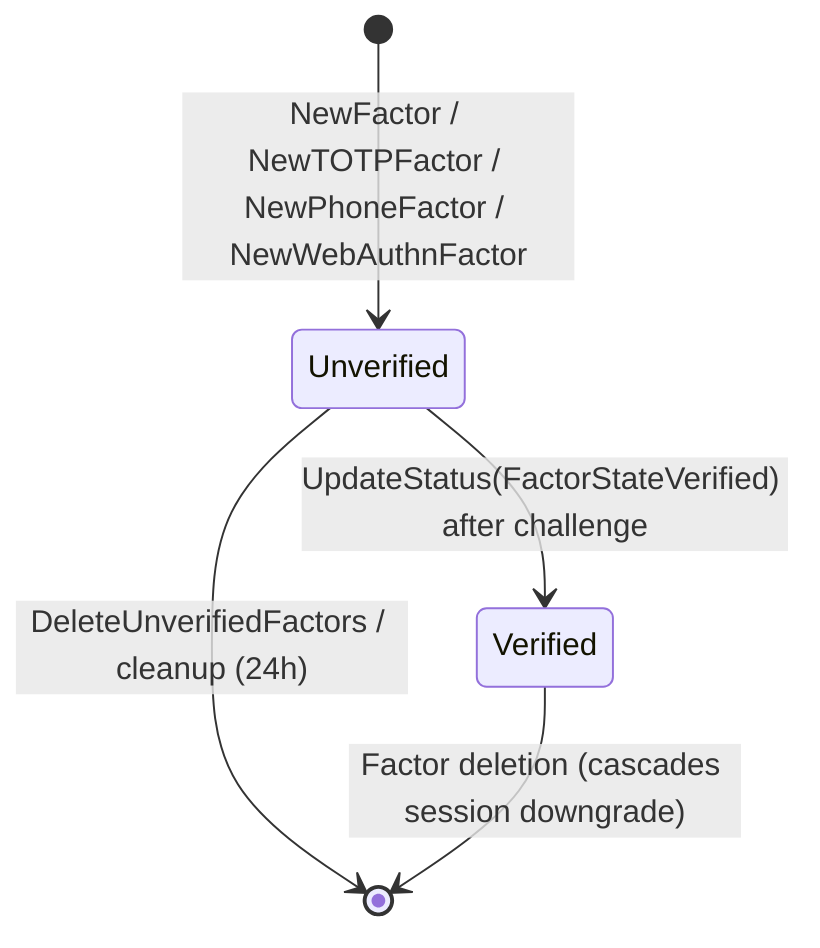

## Purpose

Documents the lifecycle of rows in the `auth.mfa_factors` table. MFA factors represent second-factor authentication methods (TOTP, phone, WebAuthn) attached to a user. Factors go through a two-phase enrollment: created as `unverified`, then promoted to `verified` after a successful challenge. Only verified factors contribute to AAL2.

## Key Facts

- `FactorState` is an integer enum with two values: `FactorStateUnverified` (0) and `FactorStateVerified` (1), stored as strings `"unverified"` / `"verified"` -> `internal/models/factor.go`
- Three `factor_type` values are supported: `"totp"`, `"phone"`, and `"webauthn"` (defined as constants `TOTP`, `Phone`, `WebAuthn`) -> `internal/models/factor.go`
- `NewFactor` generates a UUID v4 id and defaults status to the provided state -> `internal/models/factor.go`
- `NewTOTPFactor` creates a factor with type `"totp"` and status `"unverified"` -> `internal/models/factor.go`
- `NewPhoneFactor` creates a factor with type `"phone"`, status `"unverified"`, and stores the phone number -> `internal/models/factor.go`
- `NewWebAuthnFactor` creates a factor with type `"webauthn"` and status `"unverified"` -> `internal/models/factor.go`
- `SetSecret` optionally encrypts the TOTP secret using `crypto.NewEncryptedString` with the factor ID as AAD -> `internal/models/factor.go`
- `SaveWebAuthnCredential` stores the WebAuthn credential as JSONB in `web_authn_credential` and extracts the AAGUID -> `internal/models/factor.go`
- `DowngradeSessionsToAAL1` deletes AMR claims for the factor's type and resets all associated sessions' AAL to `"aal1"` and `factor_id` to nil -> `internal/models/factor.go`
- `DeleteUnverifiedFactors` removes all unverified factors of a given type for a user (used before enrolling a new factor) -> `internal/models/factor.go`
- `DeleteExpiredFactors` removes unverified factors with no challenges that are older than a configurable validity duration -> `internal/models/factor.go`
- Background cleanup deletes unverified factors older than 24 hours in batches of 100 -> `internal/models/cleanup.go`
- `CreateChallenge` generates a UUID v4 challenge linked to the factor; `WriteChallengeToDatabase` also updates `last_challenged_at` -> `internal/models/factor.go`
- `CreatePhoneChallenge` generates a challenge with an encrypted OTP code for phone factors -> `internal/models/factor.go`
- `loadFactor` middleware in admin API loads a factor by `factor_id` URL param, scoped to the authenticated user -> `internal/api/admin.go`

## Fields

| Column | Type | Lifecycle Role |
|--------|------|---------------|
| id | UUID | PK, generated at creation |
| user_id | UUID | FK to users.id |
| status | VARCHAR | `"unverified"` or `"verified"` |
| factor_type | VARCHAR | `"totp"`, `"phone"`, or `"webauthn"` |
| friendly_name | VARCHAR | User-chosen display name |
| secret | VARCHAR | Encrypted TOTP secret; empty for other types |
| phone | VARCHAR | Phone number for phone factors |
| last_challenged_at | TIMESTAMPTZ | Updated when a challenge is created |
| web_authn_credential | JSONB | WebAuthn credential data |
| web_authn_aaguid | UUID | Authenticator AAGUID |

## Relationships

| Related Entity | Relationship | FK |
|---------------|-------------|-----|
| [[PROC-AUTH-USERS-LIFECYCLE]] | belongs to | `mfa_factors.user_id -> users.id` |
| [[PROC-AUTH-SESSIONS-LIFECYCLE]] | referenced by | `sessions.factor_id -> mfa_factors.id` |

## States and Transitions



## Worked Examples

### Query: List all verified MFA factors for a user

```sql
SELECT id, factor_type, friendly_name, created_at
FROM auth.mfa_factors
WHERE user_id = '550e8400-e29b-41d4-a716-446655440000'
  AND status = 'verified'
ORDER BY created_at ASC;
```

### Enum: Factor types and states

| factor_type | Description |
|-------------|-------------|
| `totp` | Time-based one-time password (authenticator app) |
| `phone` | SMS/voice OTP |
| `webauthn` | WebAuthn/FIDO2 security key |

| status | Meaning |
|--------|---------|
| `unverified` | Enrolled but not yet confirmed via challenge |
| `verified` | Successfully verified, contributes to AAL2 |

## API-Level Enrollment and Challenge Flow

The MFA API handlers in `internal/api/mfa.go` implement the full enrollment, challenge, and verification pipeline:

### Enrollment (`EnrollFactor`)

- Dispatches by `factor_type`: `"totp"`, `"phone"`, or `"webauthn"` -> `internal/api/mfa.go`
- Each type has a per-type enable flag: `config.MFA.Phone.EnrollEnabled`, `config.MFA.TOTP.EnrollEnabled`, `config.MFA.WebAuthn.EnrollEnabled` -> `internal/api/mfa.go`
- `validateFactors()` enforces: max enrolled factors (`config.MFA.MaxEnrolledFactors`), max verified factors (`config.MFA.MaxVerifiedFactors`), friendly name uniqueness, expired factor cleanup, and AAL2 requirement if any factor is already verified -> `internal/api/mfa.go`
- TOTP enrollment generates a key via `totp.Generate()`, renders a QR code as inline SVG, and returns the secret + URI + QR to the client -> `internal/api/mfa.go`
- Phone enrollment validates E.164 format, deletes any existing unverified phone factors with the same number, and creates a new unverified factor -> `internal/api/mfa.go`
- WebAuthn enrollment creates an unverified factor; the actual credential registration happens during the challenge/verify phase -> `internal/api/mfa.go`

### Challenge

- **TOTP challenge**: Creates a simple challenge record with IP address, no external communication needed -> `internal/api/mfa.go`
- **Phone challenge**: Generates an OTP (`crypto.GenerateOtp`), creates encrypted phone challenge, sends SMS via `SendSMS` hook (if enabled) or direct SMS provider; enforces `MaxFrequency` rate limit on `last_challenged_at` -> `internal/api/mfa.go`
- **WebAuthn challenge**: For unverified factors, generates credential creation options (with exclusion list of existing credentials); for verified factors, generates assertion options -> `internal/api/mfa.go`
- All challenges have configurable expiry via `config.MFA.ChallengeExpiryDuration` -> `internal/api/mfa.go`

### Verification

- TOTP verification uses `totp.ValidateCustom` with SHA1 algorithm, 6-digit codes, 1-period skew -> `internal/api/mfa.go`
- Phone verification compares submitted code against encrypted OTP stored in challenge using `subtle.ConstantTimeCompare` -> `internal/api/mfa.go`
- WebAuthn verification validates credential response via `go-webauthn/webauthn` library -> `internal/api/mfa.go`
- On successful verification: factor status updated to `verified`, session AAL upgraded to `aal2`, AMR claim added, new tokens issued -> `internal/api/mfa.go`
- The `mfa-verification` hook is invoked if configured, allowing custom validation logic -> `internal/api/mfa.go`

## Agent Guidance

- Factor enrollment is two-phase: create (unverified) then verify via challenge. Only verified factors affect AAL.
- Deleting a verified factor triggers `DowngradeSessionsToAAL1`, which drops all associated sessions back to AAL1 and removes relevant AMR claims. This is an important side effect to be aware of.
- The cleanup process removes stale unverified factors after 24 hours, but only those with no associated challenges.
- TOTP secrets are encrypted at rest when database encryption is enabled; the factor ID is used as Additional Authenticated Data (AAD).
- A user's `HighestPossibleAAL()` is derived from whether any verified factor exists -- it is not stored on the user row.

## Related

- [[SYS-AUTH]] -- parent system artifact
- [[SCH-AUTH]] -- schema definition for mfa_factors table
- [[PROC-AUTH-USERS-LIFECYCLE]] -- parent user entity
- [[PROC-AUTH-SESSIONS-LIFECYCLE]] -- sessions upgraded to AAL2 via factors
