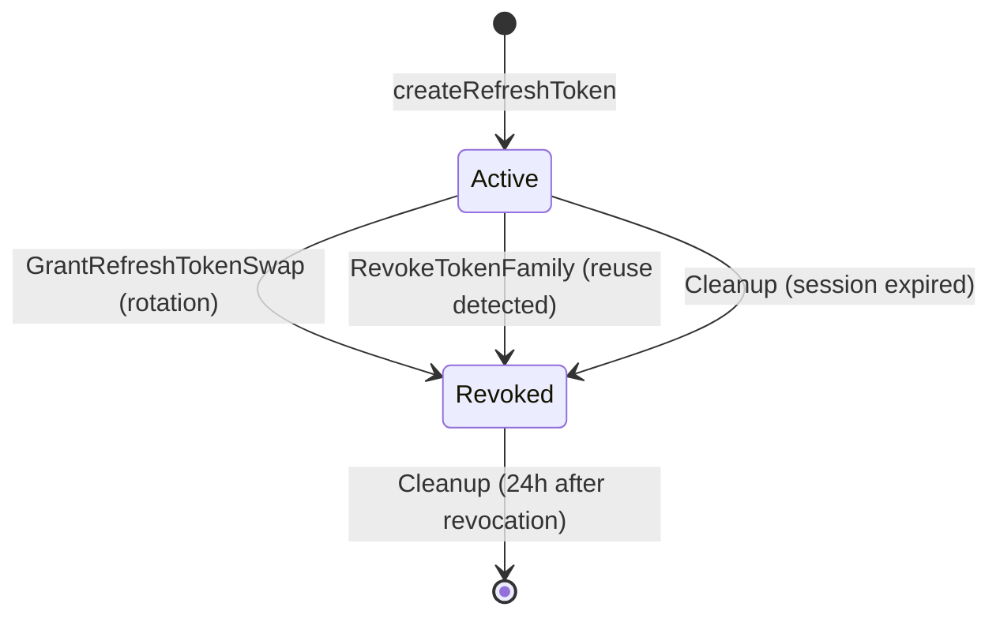

## Purpose

Documents the lifecycle of rows in the `auth.refresh_tokens` table. Refresh tokens are the mechanism for obtaining new access tokens without re-authentication. They form parent-child chains for rotation detection and are tied to sessions. Two token formats coexist: legacy 12-character alphanumeric tokens and newer HMAC-signed tokens with embedded session references.

## Key Facts

- `createRefreshToken` generates a 12-character `crypto.SecureAlphanumeric` token string and links it to a session -> `internal/models/refresh_token.go`
- If no session exists (`SessionId == nil`), `createRefreshToken` creates a new session first, then creates the token -> `internal/models/refresh_token.go`
- The `parent` column stores the previous token's value, forming a chain for rotation detection -> `internal/models/refresh_token.go`
- `GrantRefreshTokenSwap` revokes the old token (`revoked = true`), creates a new one with `parent` set to old token, and logs a `TokenRevokedAction` audit entry -> `internal/models/refresh_token.go`
- `RevokeTokenFamily` uses a recursive CTE to find and revoke all descendant tokens when a reuse attempt is detected -> `internal/models/refresh_token.go`
- When a session_id exists, `RevokeTokenFamily` takes a fast path: revokes all non-revoked tokens for that session instead of walking the chain -> `internal/models/refresh_token.go`
- The `id` column is a `BIGINT` serial primary key (not UUID), used for ordering to find the latest active token -> `internal/models/refresh_token.go`
- `FindCurrentlyActiveRefreshToken` returns the latest non-revoked token for a session, ordered by `id desc` -> `internal/models/sessions.go`
- Legacy tokens (exactly 12 chars) are looked up directly in the `refresh_tokens` table; new tokens are parsed as `crypto.RefreshToken` and verified via session HMAC -> `internal/models/user.go`
- New-format refresh tokens embed a session ID and are verified against the session's `refresh_token_hmac_key` -> `internal/models/user.go`
- If the HMAC key needs re-encryption (key rotation), it is transparently re-encrypted during `forUpdate` lookup -> `internal/models/user.go`
- Revoked tokens older than 24 hours are cleaned up in batches of 100 by the background cleanup process -> `internal/models/cleanup.go`
- Tokens belonging to sessions past `not_after` are bulk-revoked by cleanup before the session itself is deleted -> `internal/models/cleanup.go`
- `RefreshTokenGrantParams.Validate()` rejects tokens shorter than 12 characters and validates format based on length -> `internal/api/token_refresh.go`
- The `instance_id` column is deprecated and always set to `uuid.Nil` -> `internal/models/refresh_token.go`

## Fields

| Column | Type | Lifecycle Role |
|--------|------|---------------|
| id | BIGINT | PK, auto-increment serial |
| token | VARCHAR | The token string (12-char alphanumeric for legacy) |
| user_id | UUID | FK to users.id |
| session_id | UUID | FK to sessions.id |
| parent | VARCHAR | Previous token's value (null for first in chain) |
| revoked | BOOLEAN | Set to true on swap or family revocation |
| created_at | TIMESTAMPTZ | Set at creation |
| updated_at | TIMESTAMPTZ | Updated on revocation |

## Relationships

| Related Entity | Relationship | FK |
|---------------|-------------|-----|
| [[PROC-AUTH-USERS-LIFECYCLE]] | belongs to | `refresh_tokens.user_id -> users.id` |
| [[PROC-AUTH-SESSIONS-LIFECYCLE]] | belongs to | `refresh_tokens.session_id -> sessions.id` |

## States and Transitions



## Token Rotation Flow

1. Client presents refresh token via `POST /token?grant_type=refresh_token`
2. System looks up user + session (legacy path or HMAC-verified path)
3. Old token is revoked (`revoked = true`)
4. New token is created with `parent = old_token.token`
5. If a revoked token is presented (reuse attack), the entire token family is revoked via recursive CTE

## Worked Examples

### Query: Find the active refresh token for a session

```sql
SELECT id, token, created_at
FROM auth.refresh_tokens
WHERE session_id = '550e8400-e29b-41d4-a716-446655440000'
  AND revoked = false
ORDER BY id DESC
LIMIT 1;
```

### Query: Detect potential token reuse (revoked tokens with children)

```sql
SELECT rt.token, rt.revoked, child.token AS child_token
FROM auth.refresh_tokens rt
LEFT JOIN auth.refresh_tokens child ON child.parent = rt.token
WHERE rt.session_id = '550e8400-e29b-41d4-a716-446655440000'
  AND rt.revoked = true
  AND child.token IS NOT NULL;
```

## Agent Guidance

- Refresh token reuse detection is critical security: if a revoked token is presented, the entire family (all descendants) must be revoked to prevent session hijacking.
- Two token formats coexist: legacy 12-char tokens stored in the table, and new HMAC-based tokens that embed a session ID and counter. The lookup path branches on token length.
- The `FOR UPDATE SKIP LOCKED` pattern in token lookup means concurrent refresh attempts for the same token will get "not found" rather than blocking -- this is by design for concurrency safety.
- When sessions are deleted (logout), cascade deletes remove associated refresh tokens automatically.

## Related

- [[SYS-AUTH]] -- parent system artifact
- [[SCH-AUTH]] -- schema definition for refresh_tokens table
- [[PROC-AUTH-SESSIONS-LIFECYCLE]] -- parent session entity
- [[PROC-AUTH-USERS-LIFECYCLE]] -- parent user entity
