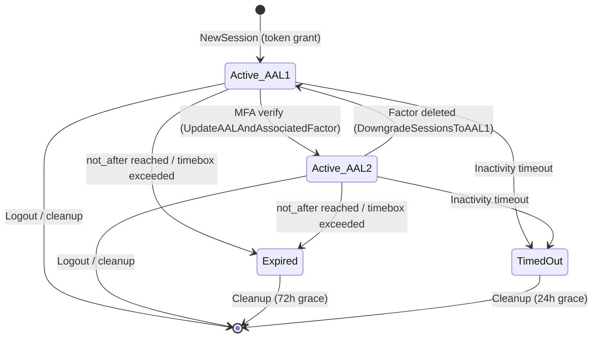

## Purpose

Documents the lifecycle of rows in the `auth.sessions` table. Sessions represent authenticated user contexts and are the anchor for refresh tokens, AAL levels, and AMR claims. Session validity is governed by multiple policies: explicit `not_after`, timeboxing, inactivity timeout, and AAL requirements.

## Key Facts

- `NewSession` generates a UUID v4 id and defaults `aal` to `"aal1"` -> `internal/models/sessions.go`
- Sessions are created inside `createRefreshToken` when `token.SessionId` is nil, meaning every first token grant creates a session -> `internal/models/refresh_token.go`
- `ApplyGrantParams` populates `factor_id`, `not_after`, `user_agent`, `ip`, `tag`, `oauth_client_id`, and `scopes` from the grant request -> `internal/models/refresh_token.go`
- `SetupRefreshTokenData` generates a cryptographic HMAC key for the session, optionally encrypted, and initializes `refresh_token_counter` to 0 -> `internal/models/refresh_token.go`
- `CheckValidity` evaluates four termination conditions in order: `not_after` expiry, timebox, inactivity timeout, and low AAL -> `internal/models/sessions.go`
- `FindSessionByID` with `forUpdate=true` uses `SELECT ... FOR UPDATE SKIP LOCKED` to enable lockless concurrency -> `internal/models/sessions.go`
- `Logout` deletes all sessions for a user; `LogoutSession` deletes one; `LogoutAllExceptMe` deletes all except the current session -> `internal/models/sessions.go`
- Three logout scopes are supported via query parameter: `global` (default, all sessions), `local` (current only), `others` (all except current) -> `internal/api/logout.go`
- `CalculateAALAndAMR` derives AAL level from AMR claims -- any AAL2-level claim promotes the session to AAL2, and AMR entries are sorted most-recent-first -> `internal/models/sessions.go`
- `InvalidateSessionsWithAALLessThan` bulk-deletes sessions below a given AAL threshold for a user -> `internal/models/sessions.go`
- Expired sessions (`not_after < now() - 72 hours`) are cleaned up in batches of 10 to avoid cascade overload -> `internal/models/cleanup.go`
- Timebox cleanup deletes sessions older than the configured `Sessions.Timebox` duration plus a 24-hour grace period -> `internal/models/cleanup.go`
- Inactivity cleanup targets sessions where `refreshed_at + inactivity_timeout < now() - 24 hours` -> `internal/models/cleanup.go`
- `RevokeOAuthSessions` deletes all sessions tied to a specific OAuth client for a user -> `internal/models/sessions.go`
- `UpdateAALAndAssociatedFactor` changes a session's AAL level and associated factor_id after MFA verification -> `internal/models/sessions.go`

## Fields

| Column | Type | Lifecycle Role |
|--------|------|---------------|
| id | UUID | PK, generated at creation |
| user_id | UUID | FK to users.id |
| aal | VARCHAR | Authentication assurance level (aal1/aal2/aal3) |
| factor_id | UUID | FK to mfa_factors.id, set on MFA step-up |
| not_after | TIMESTAMPTZ | Hard expiry; sessions past this are invalid |
| refreshed_at | TIMESTAMPTZ | Updated on each token refresh |
| user_agent | VARCHAR | Captured from request headers |
| ip | VARCHAR | Captured from request IP |
| tag | VARCHAR | Application-defined session tag |
| oauth_client_id | UUID | Set for OAuth client sessions |
| scopes | VARCHAR | OAuth scopes granted |
| refresh_token_hmac_key | VARCHAR | Encrypted HMAC key for refresh token signing |
| refresh_token_counter | BIGINT | Monotonic counter for token rotation detection |

## Relationships

| Related Entity | Relationship | FK |
|---------------|-------------|-----|
| [[PROC-AUTH-USERS-LIFECYCLE]] | belongs to | `sessions.user_id -> users.id` |
| [[PROC-AUTH-REFRESH-TOKENS-LIFECYCLE]] | has many | `refresh_tokens.session_id` |
| [[PROC-AUTH-MFA-FACTORS-LIFECYCLE]] | optional factor | `sessions.factor_id -> mfa_factors.id` |

## States and Transitions



## Validity Reasons

| Reason | Code | Condition |
|--------|------|-----------|
| Valid | `SessionValid` | All checks pass |
| Past not_after | `SessionPastNotAfter` | `now > session.not_after` |
| Past timebox | `SessionPastTimebox` | `now > created_at + timebox` |
| Timed out | `SessionTimedOut` | `now > last_refreshed + inactivity_timeout` |
| Low AAL | `SessionLowAAL` | Session AAL < user's highest possible AAL, past grace period |

## Worked Examples

### Query: Find all active sessions for a user

```sql
SELECT id, aal, created_at, refreshed_at, ip, user_agent
FROM auth.sessions
WHERE user_id = '550e8400-e29b-41d4-a716-446655440000'
  AND (not_after IS NULL OR not_after > now())
ORDER BY created_at DESC;
```

## Agent Guidance

- Session deletion is the primary mechanism for logout -- there is no "revoked" flag on sessions; they are hard-deleted.
- The 72-hour grace period before cleaning expired sessions allows refresh token cleanup to happen first (batch of 100) before sessions (batch of 10), preventing cascade overload.
- `FOR UPDATE SKIP LOCKED` is used extensively; if a session row is locked by another transaction, queries return "not found" rather than blocking.
- When a user changes their password, all sessions (or all except current) are deleted -- this is security-critical behavior.

## Related

- [[SYS-AUTH]] -- parent system artifact
- [[SCH-AUTH]] -- schema definition for sessions table
- [[PROC-AUTH-USERS-LIFECYCLE]] -- parent user entity
- [[PROC-AUTH-REFRESH-TOKENS-LIFECYCLE]] -- refresh tokens within sessions
- [[PROC-AUTH-MFA-FACTORS-LIFECYCLE]] -- factors that elevate session AAL
