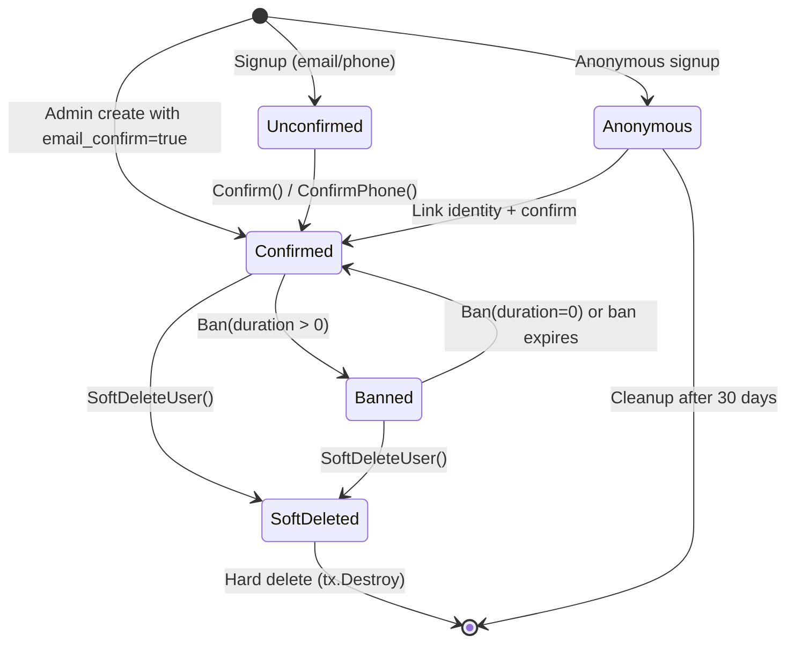

## Purpose

Documents the full lifecycle of a row in the `auth.users` table -- from creation through confirmation, banning, soft-deletion, hard-deletion, and background cleanup. The `users` table is the root entity in the auth schema; nearly every other auth entity references it via `user_id`.

## Key Facts

- User rows are created via `models.NewUser` which generates a UUID v4 `id`, hashes the password (argon2/bcrypt), and lowercases the email -> `internal/models/user.go`
- Anonymous users set `is_anonymous = true` and have empty email, phone, and password fields -> `internal/api/anonymous.go`
- Email signup requires a non-empty password and disallows providing both email and phone simultaneously -> `internal/api/signup.go`
- `BeforeSave` hook normalizes zero-value timestamps to nil for 9 nullable timestamp fields (e.g., `email_confirmed_at`, `banned_until`) -> `internal/models/user.go`
- `Confirm()` sets `email_confirmed_at` to now, clears `confirmation_token`, updates `email_verified` in user_metadata, and clears all one-time tokens -> `internal/models/user.go`
- `Ban()` sets `banned_until` to `now + duration`; passing duration 0 unbans by setting `banned_until` to nil -> `internal/models/user.go`
- `IsBanned()` returns true only if `banned_until` is non-nil AND in the future, making bans time-limited by design -> `internal/models/user.go`
- `SoftDeleteUser` obfuscates email/phone via SHA-256 hash, nullifies `encrypted_password`, clears all tokens, sets `deleted_at`, wipes both metadata maps, and calls `Logout` (deletes all sessions) -> `internal/models/user.go`
- `SoftDeleteUserIdentities` clears `identity_data` for every identity and obfuscates `provider_id` via raw SQL update -> `internal/models/user.go`
- `UpdatePassword` resets all verification/recovery tokens AND logs out all sessions (or all except current if `sessionID` is provided) -> `internal/models/user.go`
- `HighestPossibleAAL` returns AAL2 if the user has at least one verified MFA factor, otherwise AAL1 -> `internal/models/user.go`
- Background cleanup deletes anonymous users older than 30 days when `External.AnonymousUsers.Enabled` is true -> `internal/models/cleanup.go`
- The `instance_id` column is deprecated and always compared against `uuid.Nil` in all queries -> `internal/models/user.go`
- `RemoveUnconfirmedIdentities` strips an unconfirmed user's password, overwrites user_metadata with the current identity's data, and destroys all other identities -> `internal/models/user.go`
- Admin user creation accepts `password_hash` for pre-hashed imports supporting argon2, bcrypt, and Firebase scrypt formats -> `internal/models/user.go`

## Fields

| Column | Type | Lifecycle Role |
|--------|------|---------------|
| id | UUID | PK, generated at creation via `uuid.NewV4()` |
| email | VARCHAR | Set at signup, lowercased; obfuscated on soft-delete |
| phone | VARCHAR | Set at signup; obfuscated on soft-delete |
| encrypted_password | VARCHAR | Hashed at creation; nullified on soft-delete |
| email_confirmed_at | TIMESTAMPTZ | Set by `Confirm()`; indicates email verification |
| phone_confirmed_at | TIMESTAMPTZ | Set by `ConfirmPhone()` |
| banned_until | TIMESTAMPTZ | Set by `Ban(duration)`; nil = not banned |
| deleted_at | TIMESTAMPTZ | Set by `SoftDeleteUser`; nil = active |
| is_anonymous | BOOLEAN | true for anonymous signups, can become false on identity link |
| is_sso_user | BOOLEAN | true when created via SSO flow |
| last_sign_in_at | TIMESTAMPTZ | Updated on every token grant |
| raw_app_meta_data | JSONB | Tracks `provider` and `providers` list |
| raw_user_meta_data | JSONB | User-facing metadata; wiped on soft-delete |

## Relationships

| Related Entity | Relationship | FK |
|---------------|-------------|-----|
| [[PROC-AUTH-IDENTITIES-LIFECYCLE]] | has many | `identities.user_id` |
| [[PROC-AUTH-SESSIONS-LIFECYCLE]] | has many | `sessions.user_id` |
| [[PROC-AUTH-REFRESH-TOKENS-LIFECYCLE]] | has many | `refresh_tokens.user_id` |
| [[PROC-AUTH-MFA-FACTORS-LIFECYCLE]] | has many | `mfa_factors.user_id` |
| [[PROC-AUTH-WEBAUTHN-CREDENTIALS-LIFECYCLE]] | has many | `webauthn_credentials.user_id` |

## States and Transitions



## Creation Paths

1. **Email/Phone Signup** (`POST /signup`): Validates password strength, creates user via `models.NewUser`, creates identity, optionally sends confirmation email.
2. **Anonymous Signup** (`POST /signup` with no credentials): Creates user with `is_anonymous = true`, immediately issues tokens.
3. **Admin Create** (`POST /admin/users`): Can set `email_confirm: true` to skip confirmation, accepts `password_hash` for bulk imports.
4. **SSO/OAuth**: User created during external provider callback with `is_sso_user = true`.

## Worked Examples

### Query: Find all active (non-deleted, non-banned) confirmed users

```sql
SELECT id, email, created_at
FROM auth.users
WHERE deleted_at IS NULL
  AND (banned_until IS NULL OR banned_until < now())
  AND email_confirmed_at IS NOT NULL
  AND is_anonymous = false;
```

### Enum: User effective states

| State | Condition |
|-------|-----------|
| Unconfirmed | `email_confirmed_at IS NULL AND phone_confirmed_at IS NULL AND is_anonymous = false` |
| Anonymous | `is_anonymous = true` |
| Confirmed | `email_confirmed_at IS NOT NULL OR phone_confirmed_at IS NOT NULL` |
| Banned | `banned_until IS NOT NULL AND banned_until > now()` |
| Soft-deleted | `deleted_at IS NOT NULL` |

## Agent Guidance

- When investigating a user's status, always check `deleted_at`, `banned_until`, and `email_confirmed_at` / `phone_confirmed_at` together; a soft-deleted user's email is obfuscated and cannot be used for lookup.
- Password changes trigger logout of all other sessions -- this is intentional security behavior, not a bug.
- The `is_anonymous` flag can transition from `true` to `false` when an identity is linked, but never the reverse.
- `instance_id` appears in many queries but is always `uuid.Nil`; ignore it in analysis -- it is a deprecated multi-tenancy artifact.

## Related

- [[SYS-AUTH]] -- parent system artifact
- [[SCH-AUTH]] -- schema definition for users table
- [[PROC-AUTH-IDENTITIES-LIFECYCLE]] -- identity records linked to users
- [[PROC-AUTH-SESSIONS-LIFECYCLE]] -- sessions created on user authentication
- [[PROC-AUTH-REFRESH-TOKENS-LIFECYCLE]] -- refresh tokens tied to user sessions
- [[PROC-AUTH-MFA-FACTORS-LIFECYCLE]] -- MFA factors owned by users
- [[PROC-AUTH-WEBAUTHN-CREDENTIALS-LIFECYCLE]] -- passkey credentials owned by users
