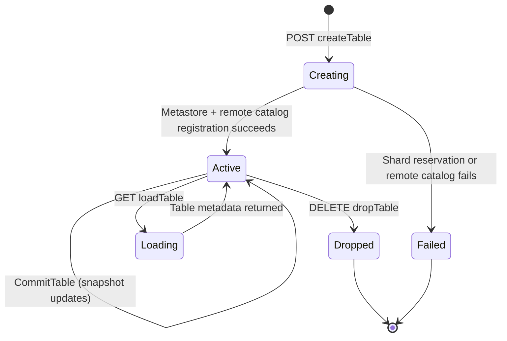

## Purpose

Describes the lifecycle of an **iceberg_tables** record — an Apache Iceberg table registered within the Supabase Storage analytics subsystem. Iceberg tables are part of **Analytics buckets**, one of three specialized bucket types in Supabase Storage. Analytics buckets are purpose-built for data lakes, ETL operations, and large-scale analytical workloads using the Apache Iceberg open table format. Data stored in Analytics buckets is SQL-accessible via Postgres foreign tables, enabling direct querying from the project's database → `sources/context/decisions/storage-overview.md`. Tables are dual-registered in a local PostgreSQL metastore and a remote REST Iceberg catalog, with shard-aware routing.

## Key Facts

- Iceberg tables are stored in `storage.iceberg_tables` with a UUID primary key and a unique index on `(namespace_id, name)` → `sources/schemas/storage/schema.md`
- Each table belongs to both an `iceberg_namespaces` record (via `namespace_id` FK with CASCADE delete) and a `buckets_analytics` record (via `bucket_id` FK with CASCADE delete) → `sources/schemas/storage/schema.md`
- Table creation runs inside a metastore transaction: it validates the catalog and namespace exist, checks a per-namespace table count limit (`maxTableCount`), then reserves a shard → `src/storage/protocols/iceberg/catalog/tenant-catalog.ts`
- Shard reservation uses `Sharder.reserve()` which returns a `shardKey`, `shardId`, and `reservationId` — the `shardKey` becomes the `warehouse` parameter for the remote catalog → `src/storage/protocols/iceberg/catalog/tenant-catalog.ts`
- After shard reservation, the tenant catalog creates the namespace (if not existing) and table on the remote REST catalog, then registers the table locally with `store.createTable()` → `src/storage/protocols/iceberg/catalog/tenant-catalog.ts`
- The local `createTable` uses INSERT ... ON CONFLICT (catalog_id, name, namespace_id) MERGE, updating `location` and `updated_at` on conflict → `src/storage/protocols/iceberg/knex.ts`
- Table loading (`loadTable`) resolves the table's `shard_key` from the local metastore, then delegates to the remote catalog with the shard key as the warehouse → `src/storage/protocols/iceberg/catalog/tenant-catalog.ts`
- Table dropping (`dropTable`) deletes from the local metastore via `store.dropTable()` using name, namespace_id, catalog_id, and tenant_id → `src/storage/protocols/iceberg/knex.ts`
- The `location` column stores the full path to the table's data on the remote Iceberg catalog, set during creation from the catalog response → `src/storage/protocols/iceberg/catalog/tenant-catalog.ts`
- `remote_table_id` stores the Iceberg `table-uuid` from the remote catalog metadata for cross-reference → `src/storage/protocols/iceberg/catalog/tenant-catalog.ts`
- Table commit/update operations (`updateTable`) go through the remote catalog after resolving the shard key, supporting requirements/assertions and metadata updates → `src/storage/protocols/iceberg/catalog/tenant-catalog.ts`
- Advisory locks (`pg_advisory_xact_lock`) are used on the namespace resource before table creation to prevent concurrent creation races → `src/storage/protocols/iceberg/catalog/tenant-catalog.ts`
- The `shard_key` and `shard_id` columns enable multi-shard routing — each table is assigned to a specific shard during creation → `sources/schemas/storage/schema.md`
- Iceberg tables belong to Analytics buckets — one of three Storage bucket types (Files, Analytics, Vector) — purpose-built for data lakes and analytical workloads → `sources/context/decisions/storage-overview.md`
- Analytics bucket data is SQL-accessible via Postgres foreign tables, enabling direct querying alongside application data → `sources/context/decisions/storage-overview.md`

## Fields

| Column | Type | Constraints | Notes |
|--------|------|-------------|-------|
| id | UUID | PK, default: gen_random_uuid() | Local table identifier |
| namespace_id | UUID | FK -> iceberg_namespaces.id ON DELETE CASCADE | Parent namespace |
| bucket_id | TEXT | FK -> buckets_analytics.id ON DELETE CASCADE | Parent analytics bucket |
| catalog_id | UUID | FK -> buckets_analytics.id, NULLABLE | Catalog reference |
| name | TEXT | COLLATE "C", NOT NULL | Table name within namespace |
| location | TEXT | NOT NULL | Remote catalog data path |
| remote_table_id | TEXT | NULLABLE | Iceberg table-uuid from remote |
| shard_key | TEXT | NULLABLE | Shard routing key |
| shard_id | TEXT | NULLABLE | Shard identifier |
| created_at | TIMESTAMPTZ | NOT NULL, default: now() | Creation time |
| updated_at | TIMESTAMPTZ | NOT NULL, default: now() | Last update time |

## Relationships

- **iceberg_namespaces** `1:N` tables — each table belongs to one namespace; CASCADE delete
- **buckets_analytics** `1:N` tables — each table belongs to one analytics bucket; CASCADE delete
- Remote Iceberg REST catalog — tables are dual-registered locally and remotely

## Creation Path

1. Client sends POST to `/:prefix/namespaces/:namespace/tables` with table schema definition
2. Route handler delegates to `icebergCatalog.createTable()` on `TenantAwareRestCatalog`
3. Within a metastore transaction:
   a. Validate catalog and namespace exist
   b. Check table does not already exist (throws `ResourceAlreadyExists` if it does)
   c. Acquire advisory lock on the namespace resource
   d. Verify per-namespace table count limit
   e. Reserve a shard via `Sharder.reserve()`
   f. Create namespace on remote catalog (idempotent, ignores 409)
   g. Create table on remote catalog
   h. Insert local metastore record with `store.createTable()`
   i. Confirm shard reservation

## States and Transitions

Iceberg tables do not have an explicit status column. Their lifecycle is:



## Worked Examples

### Create a table in the local metastore
```sql
-- store.createTable() via KnexMetastore:
INSERT INTO storage.iceberg_tables (name, catalog_id, bucket_name, namespace_id, location, shard_key, shard_id, remote_table_id, tenant_id)
VALUES ('events', 'catalog-uuid', 'my-analytics-bucket', 'ns-uuid', 's3://warehouse/tenant/ns/events', 'shard-key-1', 'shard-1', 'iceberg-table-uuid', 'tenant-123')
ON CONFLICT (catalog_id, name, namespace_id)
DO UPDATE SET updated_at = NOW(), location = EXCLUDED.location
RETURNING *;
```

### Load a table
```sql
-- Metastore lookup before remote catalog call:
SELECT id, name, namespace_id, location, shard_key, shard_id
FROM storage.iceberg_tables
WHERE name = 'events' AND namespace_id = 'ns-uuid' AND tenant_id = 'tenant-123';
-- Then remote catalog is called with warehouse = shard_key
```

### Drop a table
```sql
-- store.dropTable():
DELETE FROM storage.iceberg_tables
WHERE name = 'events' AND namespace_id = 'ns-uuid' AND catalog_id = 'catalog-uuid' AND tenant_id = 'tenant-123';
```

### List tables in a namespace
```sql
-- store.listTables():
SELECT id, name, namespace_id, shard_id, shard_key
FROM storage.iceberg_tables
WHERE namespace_id = 'ns-uuid' AND tenant_id = 'tenant-123'
ORDER BY created_at ASC;
```

## Agent Guidance

- Iceberg tables are dual-registered: always check both the local metastore and the remote catalog state when debugging inconsistencies.
- The `shard_key` is essential for routing — if it is NULL, the table cannot be loaded from the remote catalog (`ShardNotFound` error).
- Table creation is transactional with shard reservation: if the remote catalog call fails, the shard reservation should be cancelled, but edge cases may leave orphaned reservations.
- The `ON CONFLICT MERGE` behavior on `createTable` means re-creating a table with the same name in the same namespace updates the `location` rather than failing — this is intentional for idempotent replays.
- Namespace deletion is blocked by a foreign key RESTRICT constraint if tables still exist within it — `dropNamespace` catches this and throws `IcebergResourceNotEmpty`.
- The `catalog_id` and `bucket_id` both reference `buckets_analytics` but serve different purposes: `bucket_id` is the direct owner, while `catalog_id` is the logical catalog mapping.

## Related

- [[SYS-STORAGE]] — parent system artifact for the storage service
- [[SCH-STORAGE]] — schema artifact describing all storage tables including iceberg_tables
