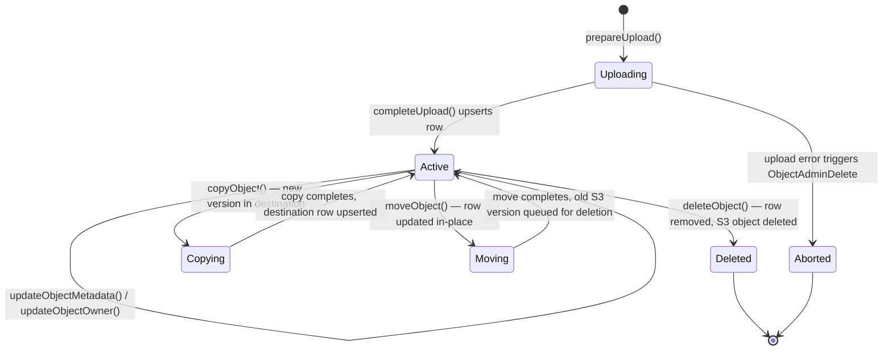

## Purpose

Describes the full lifecycle of a storage **object** — from creation through update, copy, move, and deletion — including the database state changes and backend (S3) interactions at each step.

## Key Facts

- Objects are stored in the `storage.objects` table with a composite unique index on `(bucket_id, name)` → `src/storage/database/knex.ts`
- Object primary key is a UUID generated via `gen_random_uuid()` with a `version` column (also UUID) that changes on every mutation → `src/storage/schemas/object.ts`
- The `Uploader.prepareUpload()` method runs RLS permission checks via `testPermission()` before generating a new version UUID → `src/storage/uploader.ts`
- Upload completion uses `db.upsertObject()` which performs an INSERT ... ON CONFLICT (name, bucket_id) MERGE, making every upload an upsert at the DB level → `src/storage/database/knex.ts`
- After upsert, if a previous version existed, `ObjectAdminDelete` is queued to clean up the old version from S3 backend storage → `src/storage/uploader.ts`
- Object deletion within a transaction first locks the row with `forUpdate`, deletes from DB, then deletes from S3 backend → `src/storage/object.ts`
- Batch deletion (`deleteObjects`) processes objects in chunks bounded by `requestUrlLengthLimit` to avoid URL length overflow → `src/storage/object.ts`
- Copy creates a new version UUID, copies in S3 backend, then upserts the destination object in DB within a transaction using `waitObjectLock` with a 3-second timeout → `src/storage/object.ts`
- Move operation updates the existing DB row (name, bucket_id, version) rather than deleting and recreating, then queues cleanup of the old S3 version → `src/storage/object.ts`
- Move uses `testPermission` to verify the user can both read the source and write to the destination before proceeding → `src/storage/object.ts`
- The `metadata` column stores backend-derived metadata (size, eTag, mimetype, cacheControl, lastModified) while `user_metadata` stores client-supplied custom metadata → `src/storage/schemas/object.ts`
- Object owner is stored in both `owner` (UUID-only) and `owner_id` (any string) columns for backward compatibility → `src/storage/database/knex.ts`
- `waitObjectLock` uses `pg_advisory_xact_lock` to prevent concurrent modifications to the same object → `src/storage/database/knex.ts`
- Webhook events are sent for object created (POST/PUT), removed, moved, copied, and metadata-updated operations → `src/storage/object.ts`

## Fields

| Column | Type | Constraints | Notes |
|--------|------|-------------|-------|
| id | UUID | PK, default: gen_random_uuid() | Immutable identifier |
| bucket_id | TEXT | FK -> buckets.id | Parent bucket |
| name | TEXT | COLLATE "C" | Object key/path within bucket |
| owner | UUID | NULLABLE | Set only if owner is a valid UUID |
| owner_id | TEXT | NULLABLE | Always set to the raw owner string |
| version | TEXT | NOT NULL | UUID regenerated on every mutation |
| metadata | JSONB | NULLABLE | Backend metadata (size, eTag, mimetype) |
| user_metadata | JSONB | NULLABLE | Custom user-supplied metadata |
| level | INT | NULLABLE, generated | Auto-computed path depth |
| created_at | TIMESTAMPTZ | default: now() | Row creation time |
| updated_at | TIMESTAMPTZ | default: now() | Last modification time |
| last_accessed_at | TIMESTAMPTZ | default: now() | Updated on owner change |

## Relationships

- **buckets** `1:N` objects — every object belongs to exactly one bucket via `bucket_id`
- **s3_multipart_uploads** — multipart uploads target a future object by `(bucket_id, key)` and convert to an object on completion
- **prefixes** — generated from object paths, share `bucket_id` namespace

## Creation Path

1. Client sends upload request (standard POST, S3 PutObject, or TUS resumable)
2. `Uploader.prepareUpload()` checks RLS permissions via `testPermission()` and generates a new version UUID
3. File body is streamed to the S3 backend via `backend.uploadObject()`
4. `Uploader.completeUpload()` acquires an advisory lock via `waitObjectLock`, then calls `db.upsertObject()`
5. If a previous version existed, `ObjectAdminDelete` event is queued to clean up old S3 data
6. Webhook event (`ObjectCreatedPostEvent` or `ObjectCreatedPutEvent`) is dispatched

## States and Transitions

Objects do not have an explicit `status` column. Their lifecycle states are implicit:



## Worked Examples

### Upload a new object
```sql
-- Uploader.completeUpload() executes this upsert:
INSERT INTO storage.objects (name, bucket_id, owner, owner_id, metadata, user_metadata, version)
VALUES ('photos/cat.png', 'avatars', 'a1b2-...', 'a1b2-...', '{"size":1234,"mimetype":"image/png"}', '{}', 'v-uuid-1')
ON CONFLICT (name, bucket_id)
DO UPDATE SET metadata = EXCLUDED.metadata, user_metadata = EXCLUDED.user_metadata, version = EXCLUDED.version, owner = EXCLUDED.owner, owner_id = EXCLUDED.owner_id;
```

### Delete a single object
```sql
-- ObjectStorage.deleteObject() within transaction:
SELECT id, version FROM storage.objects WHERE bucket_id = 'avatars' AND name = 'photos/cat.png' FOR UPDATE;
DELETE FROM storage.objects WHERE name = 'photos/cat.png' AND bucket_id = 'avatars' RETURNING *;
-- Then backend.deleteObject() removes the S3 file
```

### Copy an object
```sql
-- Destination upsert after S3 copy:
INSERT INTO storage.objects (name, bucket_id, owner, owner_id, metadata, user_metadata, version)
VALUES ('photos/cat-copy.png', 'avatars', 'a1b2-...', 'a1b2-...', '{"size":1234,"eTag":"abc"}', '{}', 'new-version-uuid')
ON CONFLICT (name, bucket_id)
DO UPDATE SET metadata = EXCLUDED.metadata, version = EXCLUDED.version, owner = EXCLUDED.owner, owner_id = EXCLUDED.owner_id;
```

## Agent Guidance

- When debugging missing objects, check both the `storage.objects` table and the S3 backend — they can diverge if `ObjectAdminDelete` queue jobs fail.
- The `version` column is critical: every mutation generates a new version UUID, and the old version's S3 data is cleaned up asynchronously.
- Object locking uses PostgreSQL advisory locks (`pg_advisory_xact_lock`), not row-level locks, so lock contention may not appear in standard lock monitoring.
- The `owner` column only stores UUIDs (non-UUID owners are stored in `owner_id` only), which can cause confusion when the auth subject is not a UUID.
- `last_accessed_at` is only updated by `updateObjectOwner`, not by reads — it does not track actual access patterns.

## Related

- [[SYS-STORAGE]] — parent system artifact for the storage service
- [[SCH-STORAGE]] — schema artifact describing all storage tables including objects
