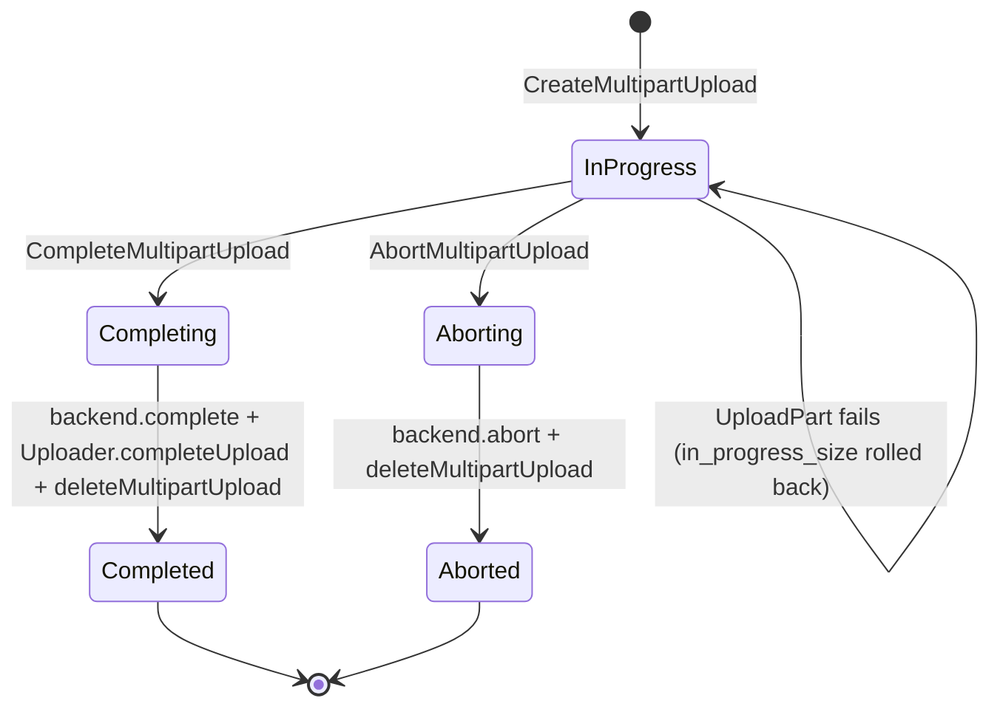

## Purpose

Describes the lifecycle of an **s3_multipart_uploads** record — the transient entity that tracks an in-progress S3-compatible multipart upload from initiation through part uploads to completion or abort.

## Key Facts

- Multipart uploads are stored in the `storage.s3_multipart_uploads` table with `id` (the S3 upload ID string) as primary key → `src/storage/schemas/multipart.ts`
- The `createMultiPartUpload` method generates a version UUID via `Uploader.prepareUpload()` before calling `backend.createMultiPartUpload()` to get the S3 upload ID → `src/storage/protocols/s3/s3-handler.ts`
- The upload row stores `in_progress_size` (default 0) which is atomically incremented as parts are uploaded, and an `upload_signature` for tamper detection → `src/storage/database/knex.ts`
- On each part upload, `shouldAllowPartUpload` checks that `in_progress_size + ContentLength` does not exceed the bucket's file size limit → `src/storage/protocols/s3/s3-handler.ts`
- If a part upload fails, the handler rolls back the `in_progress_size` by subtracting the failed part's `ContentLength` in a separate transaction → `src/storage/protocols/s3/s3-handler.ts`
- Completion (`completeMultiPartUpload`) calls `backend.completeMultipartUpload`, then `Uploader.completeUpload` to upsert the final object, and finally deletes the multipart upload record → `src/storage/protocols/s3/s3-handler.ts`
- Abort (`abortMultipartUpload`) calls `backend.abortMultipartUpload` to clean up S3 parts, then deletes the DB record via `db.deleteMultipartUpload` → `src/storage/protocols/s3/s3-handler.ts`
- Parts are deleted via CASCADE when the multipart upload record is deleted, since `s3_multipart_uploads_parts.upload_id` has `ON DELETE CASCADE` → `sources/schemas/storage/schema.md`
- The `version` column links the multipart upload to the future object version — it is passed through to `completeUpload` → `src/storage/protocols/s3/s3-handler.ts`
- `user_metadata` and `metadata` columns on the upload record carry forward to the completed object — set at initiation time from the `CreateMultipartUpload` command → `src/storage/database/knex.ts`
- `listMultipartUploads` supports prefix filtering, delimiter-based folder grouping, and continuation tokens (key marker + upload ID marker) → `src/storage/protocols/s3/s3-handler.ts`
- RLS is enabled on the `s3_multipart_uploads` table, but most operations run as super user after initial permission checks → `sources/schemas/storage/schema.md`
- The `metadata` column was added in migration 57 (`s3-multipart-uploads-metadata`) and is conditionally included in queries based on the tenant's migration state → `src/storage/database/knex.ts`

## Fields

| Column | Type | Constraints | Notes |
|--------|------|-------------|-------|
| id | TEXT | PK | S3 upload ID returned by backend |
| bucket_id | TEXT | FK -> buckets.id | Target bucket |
| key | TEXT | COLLATE "C", NOT NULL | Target object name |
| version | TEXT | NOT NULL | Pre-allocated version UUID for the future object |
| in_progress_size | INT | NOT NULL, default: 0 | Running total of uploaded part sizes |
| upload_signature | TEXT | NOT NULL | Encrypted signature for tamper detection |
| owner_id | TEXT | NULLABLE | Upload initiator |
| metadata | JSONB | NULLABLE | File metadata (mimetype, etc.) set at initiation |
| user_metadata | JSONB | NULLABLE | Custom metadata set at initiation |
| created_at | TIMESTAMPTZ | NOT NULL, default: now() | Upload initiation time |

## Relationships

- **buckets** `1:N` s3_multipart_uploads — each upload targets one bucket
- **s3_multipart_uploads_parts** `1:N` — parts belong to an upload; CASCADE delete on upload removal
- **objects** — on completion, the upload converts into an object row

## Creation Path

1. Client sends `CreateMultipartUpload` S3 request with bucket, key, content type, and optional metadata
2. `Uploader.prepareUpload()` checks RLS permissions and generates a version UUID
3. `backend.createMultiPartUpload()` initiates the upload on S3 and returns an upload ID
4. `db.createMultipartUpload()` inserts the record with the S3 upload ID, version, signature, and metadata

## States and Transitions



## Worked Examples

### Create a multipart upload
```sql
-- db.createMultipartUpload():
INSERT INTO storage.s3_multipart_uploads (id, bucket_id, key, version, upload_signature, owner_id, user_metadata, metadata)
VALUES ('s3-upload-id-abc', 'my-bucket', 'large-file.zip', 'version-uuid-1', 'encrypted-sig', 'user-123', '{}', '{"mimetype":"application/zip"}')
RETURNING *;
```

### Update progress after part upload
```sql
-- db.updateMultipartUploadProgress():
UPDATE storage.s3_multipart_uploads
SET in_progress_size = 10485760, upload_signature = 'new-encrypted-sig'
WHERE id = 's3-upload-id-abc';
```

### Complete a multipart upload
```sql
-- Final step: delete the tracking record (parts cascade-delete)
DELETE FROM storage.s3_multipart_uploads WHERE id = 's3-upload-id-abc';
-- The object row was already upserted by Uploader.completeUpload()
```

### Abort a multipart upload
```sql
-- db.deleteMultipartUpload() after backend abort:
DELETE FROM storage.s3_multipart_uploads WHERE id = 's3-upload-id-abc';
-- Parts are cascade-deleted automatically
```

## Agent Guidance

- Multipart uploads are transient: they exist only between initiation and completion/abort. Any orphaned records indicate incomplete uploads that may need cleanup.
- The `in_progress_size` field is the authoritative size tracker — it is checked before each part upload to enforce bucket file size limits.
- When the `upload_signature` does not match the expected value, the upload may have been tampered with; the `shouldAllowPartUpload` method validates this.
- The `version` on the multipart upload becomes the version of the final object — there is a direct 1:1 relationship.
- Part upload failure recovery subtracts the failed part size in a separate transaction; if this recovery fails, `in_progress_size` may be inflated, blocking future parts.
- The `metadata` column is conditionally included based on migration state — queries against older tenants may not have this column.

## Related

- [[SYS-STORAGE]] — parent system artifact for the storage service
- [[SCH-STORAGE]] — schema artifact describing all storage tables
- [[PROC-STORAGE-OBJECTS-LIFECYCLE]] — the object that results from a completed multipart upload
- [[PROC-STORAGE-S3-MULTIPART-UPLOADS-PARTS-LIFECYCLE]] — individual parts within a multipart upload
