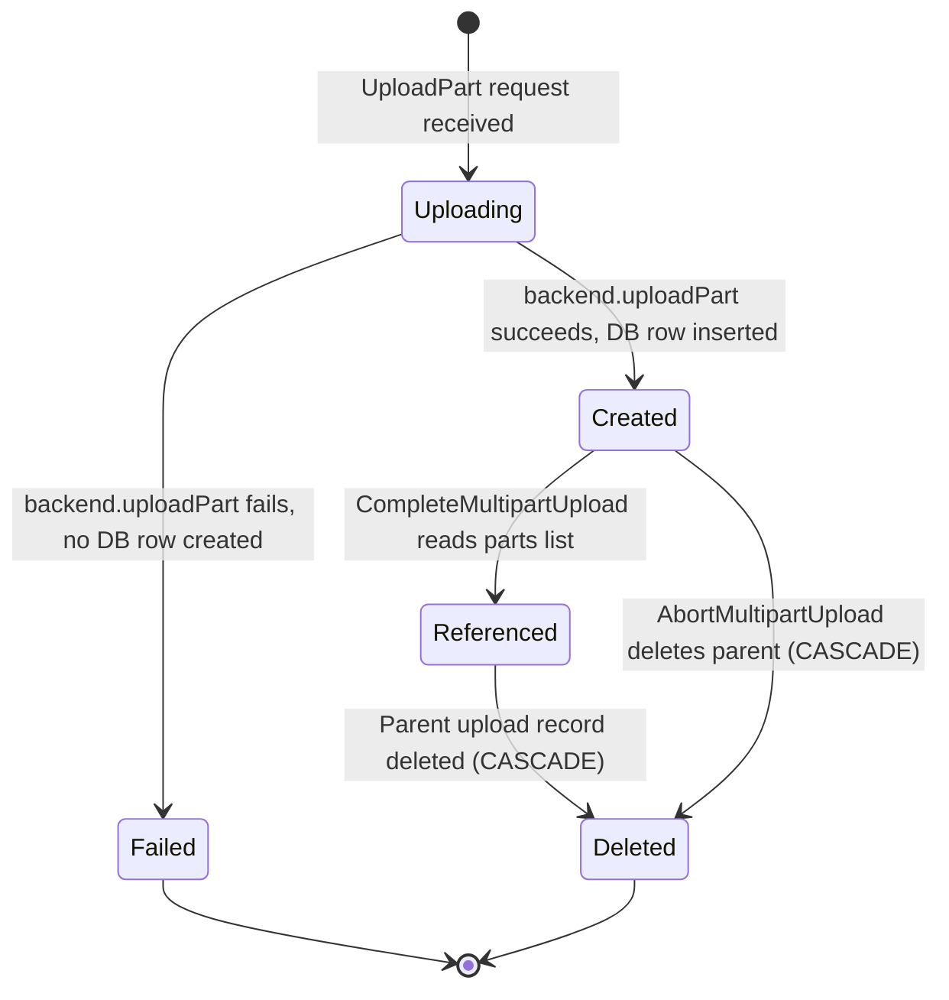

## Purpose

Describes the lifecycle of an **s3_multipart_uploads_parts** record — each individual part uploaded as part of an S3-compatible multipart upload. Parts are created during upload, referenced during completion, and cascade-deleted when the parent upload is removed.

## Key Facts

- Parts are stored in the `storage.s3_multipart_uploads_parts` table with a UUID primary key generated by `gen_random_uuid()` → `sources/schemas/storage/schema.md`
- Each part references its parent upload via `upload_id` FK with `ON DELETE CASCADE`, so parts are automatically removed when the upload record is deleted → `sources/schemas/storage/schema.md`
- The `insertUploadPart` method inserts a part record after the backend `uploadPart` call succeeds, storing the ETag returned by S3 → `src/storage/database/knex.ts`
- Part records include `upload_id`, `bucket_id`, `key`, `part_number`, `version`, `etag`, and `owner_id` as required/optional fields → `src/storage/schemas/multipart.ts`
- The `part_number` is an integer provided by the client (matching S3 API convention), used to order parts during assembly → `src/storage/schemas/multipart.ts`
- During `completeMultiPartUpload`, if the client does not provide a parts list, all parts are fetched via `listParts` with a 10,000-part maximum → `src/storage/protocols/s3/s3-handler.ts`
- `listParts` returns parts ordered by `part_number` with pagination support via `afterPart` and `maxParts` parameters → `src/storage/database/knex.ts`
- The `etag` field is set to the ETag returned by the S3 backend's `uploadPart` response, serving as a content hash for integrity verification → `src/storage/protocols/s3/s3-handler.ts`
- The `version` on each part matches the parent multipart upload's version, linking parts to the eventual object version → `src/storage/protocols/s3/s3-handler.ts`
- Parts have a `size` column (INT, default 0) that tracks the byte size of the individual part, though it is not explicitly set during insertion in the current code → `sources/schemas/storage/schema.md`
- The maximum allowed part size is 5 GB (`MAX_PART_SIZE = 5 * 1024 * 1024 * 1024`) defined as a constant in the S3 handler → `src/storage/protocols/s3/s3-handler.ts`
- A `ByteLimitTransformStream` enforces that the actual uploaded bytes match the declared `ContentLength` for each part → `src/storage/protocols/s3/s3-handler.ts`
- RLS is enabled on the parts table, but operations are executed as super user after permission checks at the upload level → `sources/schemas/storage/schema.md`

## Fields

| Column | Type | Constraints | Notes |
|--------|------|-------------|-------|
| id | UUID | PK, default: gen_random_uuid() | Auto-generated identifier |
| upload_id | TEXT | FK -> s3_multipart_uploads.id ON DELETE CASCADE | Parent upload |
| bucket_id | TEXT | FK -> buckets.id | Redundant bucket reference |
| key | TEXT | COLLATE "C", NOT NULL | Redundant object key reference |
| part_number | INT | NOT NULL | Client-specified part ordering |
| version | TEXT | NOT NULL | Matches parent upload version |
| etag | TEXT | NOT NULL | S3 backend content hash |
| size | INT | NOT NULL, default: 0 | Part byte size |
| owner_id | TEXT | NULLABLE | Part uploader identity |
| created_at | TIMESTAMPTZ | NOT NULL, default: now() | Part upload time |

## Relationships

- **s3_multipart_uploads** `1:N` parts — each part belongs to one upload; CASCADE delete
- **buckets** `1:N` parts — redundant FK for bucket reference

## Creation Path

1. Client sends `UploadPart` S3 request with bucket, key, upload ID, part number, and body
2. `S3ProtocolHandler.uploadPart()` validates the upload exists via `findMultipartUpload`
3. `shouldAllowPartUpload` verifies file size limits are not exceeded
4. Body is streamed through `ByteLimitTransformStream` to `backend.uploadPart()`
5. On success, `db.insertUploadPart()` inserts the part record with the returned ETag

## States and Transitions

Parts do not have an explicit status field. Their lifecycle is simple:



## Worked Examples

### Insert a part after successful upload
```sql
-- db.insertUploadPart():
INSERT INTO storage.s3_multipart_uploads_parts
  (upload_id, bucket_id, key, part_number, version, etag, owner_id)
VALUES
  ('s3-upload-id-abc', 'my-bucket', 'large-file.zip', 1, 'version-uuid-1', '"abc123"', 'user-123')
RETURNING *;
```

### List parts for completion
```sql
-- db.listParts():
SELECT etag, part_number, size, upload_id, created_at
FROM storage.s3_multipart_uploads_parts
WHERE upload_id = 's3-upload-id-abc'
ORDER BY part_number
LIMIT 10000;
```

### Parts cascade-deleted on upload completion
```sql
-- When the parent upload is deleted:
DELETE FROM storage.s3_multipart_uploads WHERE id = 's3-upload-id-abc';
-- All rows in s3_multipart_uploads_parts with upload_id = 's3-upload-id-abc' are automatically deleted
```

## Agent Guidance

- Parts are ephemeral child records — they are never accessed independently outside the context of their parent multipart upload.
- The `etag` is the critical field used during `CompleteMultipartUpload` to identify each part to the S3 backend; if ETags are lost, the upload cannot be completed.
- The redundant `bucket_id` and `key` columns on parts duplicate data from the parent upload — this is intentional for RLS policy evaluation and query efficiency.
- If a part upload fails at the backend level, no DB record is created, but the `in_progress_size` on the parent upload is rolled back in a compensating transaction.
- The 10,000-part limit in `listParts` during completion is a practical maximum matching AWS S3 limits, though it is not enforced as a hard constraint during part creation.

## Related

- [[SYS-STORAGE]] — parent system artifact for the storage service
- [[SCH-STORAGE]] — schema artifact describing all storage tables
- [[PROC-STORAGE-S3-MULTIPART-UPLOADS-LIFECYCLE]] — parent multipart upload entity lifecycle
