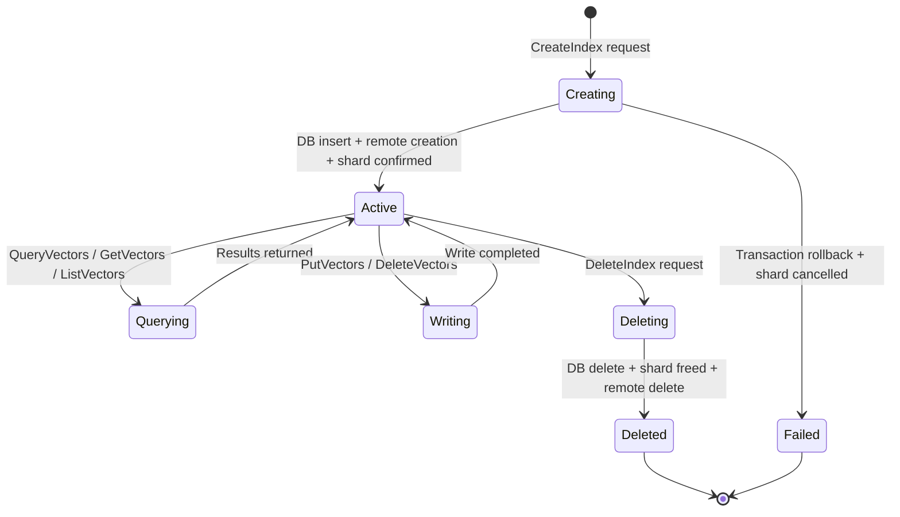

## Purpose

Describes the lifecycle of a **vector_indexes** record — a vector similarity search index registered within a vector bucket in the Supabase Storage vector subsystem. Vector indexes are part of **Vector buckets**, one of three specialized bucket types in Supabase Storage. Vector buckets are designed for AI and ML applications requiring semantic search capabilities, including AI-powered search, RAG systems, and embedding storage. They support two index types (HNSW and Flat) and multiple distance metrics (cosine, euclidean, L2) with metadata filtering → `sources/context/decisions/storage-overview.md`. Indexes are dual-registered in a local PostgreSQL metastore and a remote S3 Vectors backend, with shard-aware routing.

## Key Facts

- Vector indexes are stored in `storage.vector_indexes` with a unique index on `(name, bucket_id)` → `sources/schemas/storage/schema.md`
- Each index belongs to a `buckets_vectors` record via `bucket_id` FK → `sources/schemas/storage/schema.md`
- Index creation runs within a transaction: acquires a bucket-level advisory lock, checks the bucket exists, enforces `maxIndexCount` per bucket, inserts the DB record, then creates on the remote backend → `src/storage/protocols/vector/vector-store.ts`
- Shard reservation via `Sharder.reserve()` returns a `shardKey` that becomes the `vectorBucketName` for the remote S3 Vectors API — the tenant-prefixed index name (`{tenantId}-{indexName}`) is used on the remote side → `src/storage/protocols/vector/vector-store.ts`
- If the remote index creation throws a `ConflictException`, the shard reservation is still confirmed (idempotent behavior) → `src/storage/protocols/vector/vector-store.ts`
- If the overall transaction fails, `Sharder.cancel()` is called to release the shard reservation → `src/storage/protocols/vector/vector-store.ts`
- Index deletion finds the shard via `Sharder.findShardByResourceId`, deletes the local DB record, frees the shard, then deletes from the remote backend → `src/storage/protocols/vector/vector-store.ts`
- The `createVectorIndex` DB method catches PostgreSQL unique violation (error code 23505) and throws `S3VectorConflictException` → `src/storage/protocols/vector/knex.ts`
- The `dimension` column is a required integer specifying the vector dimensionality; `distance_metric` specifies the similarity function (e.g., cosine, euclidean) → `src/storage/schemas/vector.ts`
- `metadata_configuration` is an optional JSONB column that can specify `nonFilterableMetadataKeys` — if the array is empty, it is stripped before sending to the remote backend → `src/storage/protocols/vector/vector-store.ts`
- Transactions in `KnexVectorMetadataDB` retry up to 3 times on PostgreSQL serialization errors (code 40001) with exponential backoff (20ms, 40ms, 80ms) → `src/storage/protocols/vector/knex.ts`
- Advisory locks use `pg_advisory_xact_lock` with a hash of `vector:{resourceType}:{resourceId}` to prevent concurrent index creation within the same bucket → `src/storage/protocols/vector/knex.ts`
- The TypeScript `VectorIndex` type includes a `status` field, but this field is not present in the database schema and is not persisted → `src/storage/schemas/vector.ts`
- All vector data operations (put, delete, query, get, list vectors) require shard resolution before routing to the remote backend → `src/storage/protocols/vector/vector-store.ts`
- Vector indexes belong to Vector buckets — one of three Storage bucket types (Files, Analytics, Vector) — designed for AI/ML similarity search → `sources/context/decisions/storage-overview.md`
- Supported index types are HNSW (approximate nearest neighbor) and Flat (exact search); supported distance metrics are cosine, euclidean, and L2 → `sources/context/decisions/storage-overview.md`

## Fields

| Column | Type | Constraints | Notes |
|--------|------|-------------|-------|
| id | TEXT | PK, default: gen_random_uuid() | Index identifier |
| name | TEXT | COLLATE "C", NOT NULL | Index name within bucket |
| bucket_id | TEXT | FK -> buckets_vectors.id | Parent vector bucket |
| data_type | TEXT | NOT NULL | Vector data type (e.g., float32) |
| dimension | INTEGER | NOT NULL | Vector dimensionality |
| distance_metric | TEXT | NOT NULL | Similarity function (cosine, euclidean, etc.) |
| metadata_configuration | JSONB | NULLABLE | Optional filtering config |
| created_at | TIMESTAMPTZ | NOT NULL, default: now() | Creation time |
| updated_at | TIMESTAMPTZ | NOT NULL, default: now() | Last update time |

## Relationships

- **buckets_vectors** `1:N` vector_indexes — each index belongs to one vector bucket
- Remote S3 Vectors backend — indexes are dual-registered locally and on the remote vector service

## Creation Path

1. Client sends `CreateIndex` request with bucket name, index name, data type, dimension, distance metric, and optional metadata configuration
2. `VectorStoreManager.createVectorIndex()` validates parameters and verifies the bucket exists
3. Within a transaction:
   a. Acquire bucket-level advisory lock
   b. Re-verify bucket exists (double-check after lock)
   c. Count existing indexes and enforce `maxIndexCount` limit
   d. Insert local DB record via `tx.createVectorIndex()`
   e. Reserve a shard via `Sharder.reserve()`
   f. Create index on remote S3 Vectors backend using the shard key as bucket name
   g. Confirm shard reservation
4. On transaction failure, cancel shard reservation

## States and Transitions

Vector indexes do not have a persisted status column. Their lifecycle is:



## Worked Examples

### Create a vector index
```sql
-- tx.createVectorIndex() in KnexVectorMetadataDB:
INSERT INTO storage.vector_indexes (bucket_id, data_type, name, dimension, distance_metric, metadata_configuration)
VALUES ('my-vector-bucket', 'float32', 'embeddings-idx', 768, 'cosine', '{"nonFilterableMetadataKeys":["raw_text"]}');
```

### Get an index by name
```sql
-- db.getIndex():
SELECT * FROM storage.vector_indexes
WHERE bucket_id = 'my-vector-bucket' AND name = 'embeddings-idx';
```

### List indexes in a bucket
```sql
-- db.listIndexes():
SELECT name, bucket_id, created_at FROM storage.vector_indexes
WHERE bucket_id = 'my-vector-bucket'
ORDER BY name ASC
LIMIT 501;  -- maxResults + 1 for pagination detection
```

### Delete a vector index
```sql
-- tx.deleteVectorIndex():
DELETE FROM storage.vector_indexes
WHERE bucket_id = 'my-vector-bucket' AND name = 'embeddings-idx';
-- Then Sharder.freeByResource() releases the shard
-- Then vectorStore.deleteVectorIndex() removes from remote backend
```

### Count indexes for limit enforcement
```sql
-- tx.countIndexes():
SELECT COUNT(id) as count FROM storage.vector_indexes
WHERE bucket_id = 'my-vector-bucket';
```

## Agent Guidance

- Vector indexes are dual-registered: check both the local `vector_indexes` table and the remote S3 Vectors backend when debugging inconsistencies.
- The `status` field in the TypeScript type is not persisted — do not rely on it for state queries.
- The tenant-prefixed index name (`{tenantId}-{indexName}`) is used on the remote backend but not in the local DB — the local `name` column stores only the user-facing name.
- Shard routing is mandatory for all data operations (put, delete, query, get, list vectors) — if a shard cannot be found, the operation fails with `NoAvailableShard`.
- The serialization retry logic (3 attempts with exponential backoff) means that transient PostgreSQL serialization failures during concurrent index creation are automatically handled.
- `metadata_configuration.nonFilterableMetadataKeys` with an empty array is stripped before sending to the remote backend — this is a normalization step, not a bug.
- Bucket deletion is blocked if any indexes exist — the caller must delete all indexes first (enforced by `S3VectorBucketNotEmpty` error).

## Related

- [[SYS-STORAGE]] — parent system artifact for the storage service
- [[SCH-STORAGE]] — schema artifact describing all storage tables including vector_indexes
