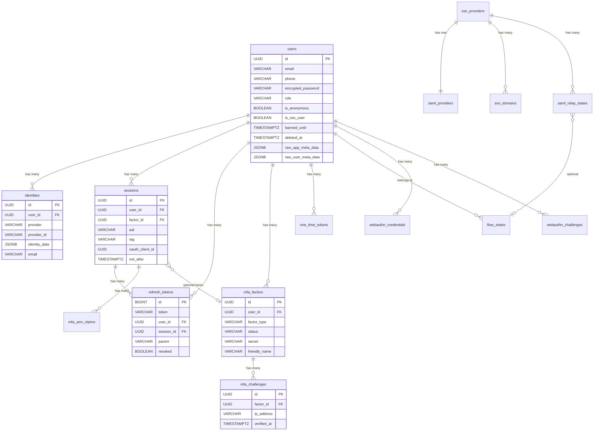

## Overview

Auth stores all authentication state in a Postgres database under the `auth` schema. The data model comprises 17 tables centered on `users` as the primary entity, with `identities` providing provider-specific profiles, `sessions` tracking active logins with AAL (Authenticator Assurance Level), and `mfa_factors` managing MFA credentials. The schema has evolved through 69 migrations (2021-2026), with recent additions including OAuth server entities, passkey/WebAuthn support, custom OAuth providers, and Web3 authentication.

## Key Facts

- 17 tables defined across the auth schema, extracted from Go model structs and migrations → `sources/schemas/auth/schema.md`
- 69 migrations spanning 2021-2026, latest adds passkey support (20260302) → `migrations/`
- User struct defines 25+ fields with `json:"-"` tags hiding sensitive fields (encrypted_password, tokens) from API responses → `internal/models/user.go`
- Identity JSON swaps `id` and `identity_id` for backward compatibility with gotrue-js client library → `internal/models/identity.go`
- Session AAL is an iota enum with three levels: AAL1 (basic), AAL2 (MFA verified), AAL3 (hardware key) → `internal/models/sessions.go`
- Factor types are three string constants: `totp`, `phone`, `webauthn`; factor status is `unverified` or `verified` → `internal/models/factor.go`
- RefreshToken uses BIGINT auto-increment PK (not UUID), with `parent` column enabling token rotation chain tracking → `internal/models/refresh_token.go`
- OneTimeToken supports 6 token types: confirmation, reauthentication, recovery, email_change_new, email_change_current, phone_change → `internal/models/one_time_token.go`
- Authentication methods enum has 16 values including OAuth, PasswordGrant, OTP, TOTPSignIn, MFAPhone, MFAWebAuthn, SSOSAML, Web3, PasskeyLogin → `internal/models/factor.go`
- User model supports soft delete (`deleted_at`), banning (`banned_until`), anonymous users (`is_anonymous`), and SSO-managed flag (`is_sso_user`) → `internal/models/user.go`
- Sessions track OAuth context with `oauth_client_id` and `scopes` columns, plus HMAC-based refresh token verification via `refresh_token_hmac_key` → `sources/schemas/auth/schema.md`
- The `instance_id` column is deprecated on users, refresh_tokens, and audit_log_entries (always compared against `uuid.Nil`) → `internal/models/user.go`

## ER Diagram



## Entities

### users
| Field | Type | Nullable | PK/FK | Notes |
|-------|------|----------|-------|-------|
| id | UUID | NOT NULL | PK | |
| aud | VARCHAR | NOT NULL | | Audience claim |
| role | VARCHAR | NOT NULL | | Default "authenticated" |
| email | VARCHAR | NULLABLE | | Primary contact email |
| is_sso_user | BOOLEAN | NOT NULL | | True for SSO-managed accounts |
| encrypted_password | VARCHAR | NULLABLE | | Argon2/bcrypt hash; hidden from JSON |
| email_confirmed_at | TIMESTAMPTZ | NULLABLE | | Set on email confirmation |
| invited_at | TIMESTAMPTZ | NULLABLE | | Set when user was invited |
| phone | VARCHAR | NULLABLE | | Primary contact phone |
| phone_confirmed_at | TIMESTAMPTZ | NULLABLE | | Set on phone confirmation |
| confirmed_at | TIMESTAMPTZ | NULLABLE | | Read-only; backward compat |
| raw_app_meta_data | JSONB | | | Provider info, custom claims |
| raw_user_meta_data | JSONB | | | User-editable metadata |
| banned_until | TIMESTAMPTZ | NULLABLE | | Non-nil + future = banned |
| deleted_at | TIMESTAMPTZ | NULLABLE | | Soft delete marker |
| is_anonymous | BOOLEAN | NOT NULL | | Anonymous sign-in flag |
| instance_id | UUID | | | DEPRECATED |

### identities
| Field | Type | Nullable | PK/FK | Notes |
|-------|------|----------|-------|-------|
| id | UUID | NOT NULL | PK | Returned as `identity_id` in JSON |
| provider_id | VARCHAR | NOT NULL | | Returned as `id` in JSON (compat) |
| user_id | UUID | NOT NULL | FK -> users.id | |
| identity_data | JSONB | | | Provider-specific profile data |
| provider | VARCHAR | NOT NULL | | e.g. "email", "google", "github" |
| email | VARCHAR | NULLABLE | | Read-only computed field |

### sessions
| Field | Type | Nullable | PK/FK | Notes |
|-------|------|----------|-------|-------|
| id | UUID | NOT NULL | PK | |
| user_id | UUID | NOT NULL | FK -> users.id | |
| factor_id | UUID | NULLABLE | FK -> mfa_factors.id | Set after MFA step-up |
| aal | VARCHAR | NULLABLE | | aal1 / aal2 / aal3 |
| not_after | TIMESTAMPTZ | NULLABLE | | Session expiry (idle timeout) |
| tag | VARCHAR | NULLABLE | | Session tag/label |
| oauth_client_id | UUID | NULLABLE | | OAuth server session context |
| scopes | VARCHAR | NULLABLE | | OAuth scopes for this session |
| refresh_token_hmac_key | VARCHAR | NULLABLE | | HMAC key for token rotation |
| refresh_token_counter | BIGINT | NULLABLE | | Monotonic counter for rotation |

### mfa_factors
| Field | Type | Nullable | PK/FK | Notes |
|-------|------|----------|-------|-------|
| id | UUID | NOT NULL | PK | |
| user_id | UUID | NOT NULL | FK -> users.id | |
| factor_type | VARCHAR | NOT NULL | | totp / phone / webauthn |
| status | VARCHAR | NOT NULL | | unverified / verified |
| friendly_name | VARCHAR | NULLABLE | | User-assigned label |
| secret | VARCHAR | | | Encrypted TOTP secret |
| phone | VARCHAR | NULLABLE | | For phone factor type |
| web_authn_credential | JSONB | NULLABLE | | WebAuthn credential data |
| web_authn_aaguid | UUID | NULLABLE | | Authenticator AAGUID |

### refresh_tokens
| Field | Type | Nullable | PK/FK | Notes |
|-------|------|----------|-------|-------|
| id | BIGINT | NOT NULL | PK | Auto-increment, not UUID |
| token | VARCHAR | NOT NULL | | Opaque token string |
| user_id | UUID | NOT NULL | FK -> users.id | |
| session_id | UUID | NULLABLE | FK -> sessions.id | |
| parent | VARCHAR | NULLABLE | | Previous token in rotation chain |
| revoked | BOOLEAN | NOT NULL | | True when consumed or invalidated |

### custom_oauth_providers
| Field | Type | Nullable | PK/FK | Notes |
|-------|------|----------|-------|-------|
| id | UUID | NOT NULL | PK | |
| provider_type | VARCHAR | NOT NULL | | oauth2 / oidc |
| identifier | VARCHAR | NOT NULL | | UNIQUE slug |
| name | VARCHAR | NOT NULL | | Display name |
| client_id | VARCHAR | NOT NULL | | OAuth client ID |
| client_secret | VARCHAR | | | Encrypted |
| pkce_enabled | BOOLEAN | NOT NULL | | PKCE enforcement |
| enabled | BOOLEAN | NOT NULL | | Active toggle |
| email_optional | BOOLEAN | NOT NULL | | Allow login without email |
| issuer | VARCHAR | NULLABLE | | OIDC issuer (OIDC only) |
| discovery_url | VARCHAR | NULLABLE | | OIDC discovery (OIDC only) |

## Worked Examples

### Query: Find all active sessions for a user with MFA step-up

```sql
SELECT s.id, s.aal, s.not_after, f.factor_type, f.friendly_name
FROM auth.sessions s
LEFT JOIN auth.mfa_factors f ON s.factor_id = f.id
WHERE s.user_id = 'd0714948-a2f3-4a32-b880-4e67e0e2a704'
  AND (s.not_after IS NULL OR s.not_after > now())
ORDER BY s.created_at DESC;
```

### Enum Values

**AAL (Authenticator Assurance Level):**
| Value | Meaning |
|-------|---------|
| aal1 | Basic authentication (password, OTP, OAuth) |
| aal2 | MFA verified (TOTP, phone, or WebAuthn factor) |
| aal3 | Hardware-bound key verified |

**Factor Type:**
| Value | Meaning |
|-------|---------|
| totp | Time-based one-time password (RFC 6238) |
| phone | SMS/WhatsApp OTP to registered phone |
| webauthn | FIDO2/passkey hardware or platform authenticator |

**Factor Status:**
| Value | Meaning |
|-------|---------|
| unverified | Enrolled but not yet confirmed |
| verified | Successfully confirmed and active |

**OneTimeToken Type:**
| Value | Meaning |
|-------|---------|
| confirmation_token | Email/phone signup confirmation |
| reauthentication_token | Sensitive operation re-auth |
| recovery_token | Password recovery |
| email_change_token_new | New email verification |
| email_change_token_current | Current email verification |
| phone_change_token | Phone number change |

**Authentication Method (AMR claims):**
| Value | Meaning |
|-------|---------|
| oauth | External OAuth provider |
| password | Email/phone + password |
| otp | One-time password (email/SMS) |
| totp | TOTP MFA factor |
| mfa_phone | Phone MFA factor |
| mfa_webauthn | WebAuthn MFA factor |
| sso/saml | SAML SSO provider |
| recovery | Password recovery flow |
| invite | Invitation acceptance |
| magiclink | Magic link email |
| anonymous | Anonymous sign-in |
| web3 | Blockchain wallet (Solana/Ethereum) |
| passkey | FIDO2 passkey login |

## Related

- [[SYS-AUTH]] -- parent system
- [[API-AUTH]] -- API surface operating on this schema
