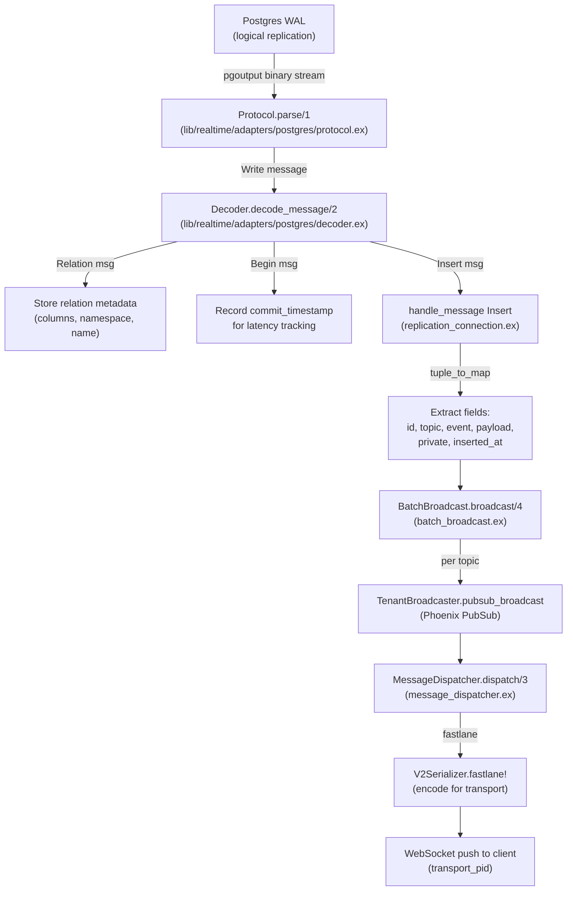

## Overview

Realtime has two CDC paths that turn Postgres changes into WebSocket messages. This artifact traces the **Broadcast Changes** path: when a row is inserted into `realtime.messages`, a `Postgrex.ReplicationConnection` receives the WAL event, decodes it through the pgoutput binary protocol, extracts fields, and broadcasts to connected channel subscribers via Phoenix PubSub. The second path (**postgres_changes** for user tables) uses a separate CDC driver but shares the downstream channel dispatch.

## Data Flow

## Field Lineage Table

| Destination Field | Origin | Transform | Code Path |
|---|---|---|---|
| `payload` (in channel push) | `realtime.messages.payload` column (JSONB) | Binary WAL -> `Decoder` strips JSONB version byte (<<1, rest>>), kept as raw JSON string, wrapped in `Jason.Fragment.new(payload)` | `decoder.ex` decode_tuple_data "jsonb" case -> `replication_connection.ex` handle_message Insert |
| `event` (in channel push) | `realtime.messages.event` column (text) | Binary WAL -> decoded as UTF-8 text, no transform | `decoder.ex` decode_tuple_data "text" case -> `replication_connection.ex` get_or_error "event" |
| `topic` (routing key) | `realtime.messages.topic` column (text) | Decoded from WAL as text; used to construct `tenant_topic` via `Tenants.tenant_topic/3` which prepends tenant_id | `replication_connection.ex` get_or_error "topic" -> `batch_broadcast.ex` send_message_and_count |
| `private` (routing flag) | `realtime.messages.private` column (bool) | Binary WAL -> `data == <<1>>` for true; determines public vs private PubSub topic | `decoder.ex` decode_tuple_data "bool" case -> `batch_broadcast.ex` Enum.group_by private |
| `id` (message identity) | `realtime.messages.id` column (UUID) | Binary WAL -> `UUID.binary_to_string!/1` converts 16-byte binary to string; placed in `meta.id` of broadcast payload | `decoder.ex` decode_tuple_data "uuid" case -> `replication_connection.ex` -> `batch_broadcast.ex` Map.put("meta") |
| `inserted_at` (timestamp) | `realtime.messages.inserted_at` column (timestamp) | Binary WAL -> signed 64-bit microseconds since 2000-01-01 -> `NaiveDateTime.add(epoch, us, :microsecond)` | `decoder.ex` decode_tuple_data "timestamp" case |
| `type` (message type tag) | Hardcoded string `"broadcast"` | Not from WAL; injected as constant in payload construction | `batch_broadcast.ex` send_message_and_count `%{"type" => "broadcast"}` |
| `commit_timestamp` (latency metric) | WAL Begin message `timestamp` field | 64-bit microsecond offset from PG epoch (2000-01-01) -> `DateTime.add(epoch, offset, :microsecond)` | `decoder.ex` decode_message_impl "B" -> `replication_connection.ex` handle_message Begin |
| `relation columns` (schema metadata) | WAL Relation message | Decoded column list with name, OID type, flags; cached in `state.relations` map keyed by relation_id | `decoder.ex` decode_columns -> `replication_connection.ex` handle_message Relation |
| Channel topic (subscriber routing) | `tenant_id` + `sub_topic` + `private` flag | `Tenants.tenant_topic/3` constructs the PubSub topic; MessageDispatcher uses fastlane metadata to route to correct transport_pid | `batch_broadcast.ex` -> `message_dispatcher.ex` dispatch |

## Key Facts

- ReplicationConnection uses `pgoutput` plugin with proto_version 2 and binary mode enabled, creating a temporary replication slot named `supabase_realtime_messages_replication_slot_{suffix}` → `lib/realtime/tenants/replication_connection.ex`
- WAL binary stream is split at the protocol level: `<<?w>>` prefix = Write (data), `<<?k>>` prefix = KeepAlive; Write messages contain nested logical decoding messages → `lib/realtime/adapters/postgres/protocol.ex`
- Decoder handles 8 message types: Begin, Commit, Origin, Relation, Insert, Update, Delete, Truncate, Type; plus Unsupported fallback for unknown messages → `lib/realtime/adapters/postgres/decoder.ex`
- Binary tuple decoding is type-aware: `bool` checks `<<1>>`, `jsonb` strips version byte prefix, `timestamp` converts from PG epoch microseconds, `uuid` uses `UUID.binary_to_string!/1`, `text` passes through raw → `lib/realtime/adapters/postgres/decoder.ex`
- Relation messages are filtered: only relations with `namespace == "realtime"` and name starting with `"messages"` are cached; unexpected relations log a warning → `lib/realtime/tenants/replication_connection.ex`
- Insert handler extracts exactly 6 fields (id, topic, event, payload, private, inserted_at) from the decoded tuple and fails with named error atoms if any are missing → `lib/realtime/tenants/replication_connection.ex`
- Latency is measured at two points: `latency_committed_at` (now minus Begin commit_timestamp) and `latency_inserted_at` (now minus row inserted_at); both emitted via telemetry → `lib/realtime/tenants/replication_connection.ex`
- MessageDispatcher implements a fastlane cache: serialized messages are cached per serializer type so multiple subscribers sharing a serializer only encode once → `lib/realtime_web/channels/realtime_channel/message_dispatcher.ex`
- Already-replayed messages are skipped during dispatch: MessageDispatcher checks message id against the `replayed_message_ids` MapSet stored in fastlane metadata → `lib/realtime_web/channels/realtime_channel/message_dispatcher.ex`
- The CDC change structs (`NewRecord`, `UpdatedRecord`, `DeletedRecord`) carry `columns`, `commit_timestamp`, `schema`, `table`, `record`, and `subscription_ids` -- this is the parallel postgres_changes path for user tables → `lib/realtime/adapters/changes.ex`

## Related

- [[SYS-REALTIME]] -- parent system
- [[SCH-REALTIME]] -- schema definitions for the tables whose WAL events are decoded here
- [[API-REALTIME]] -- WebSocket interface that delivers the final decoded messages to clients
