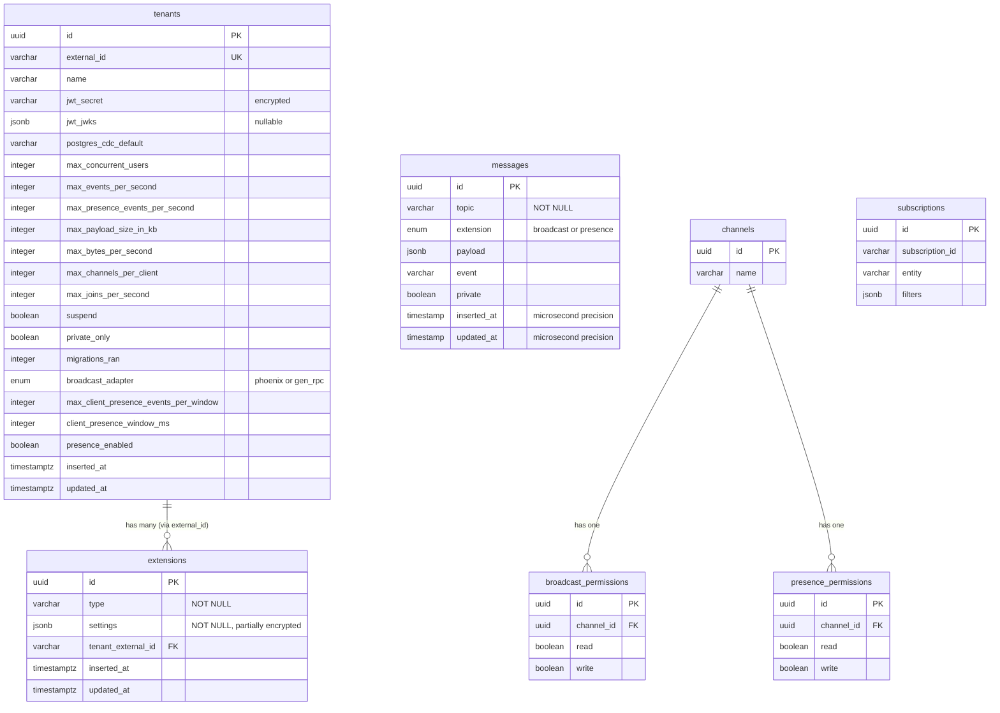

## Overview

Realtime uses two database layers. The **control plane** database stores tenant configuration in a `_realtime` schema (tenants, extensions). Each **tenant's own database** gets a `realtime` schema with channel, subscription, broadcast/presence permission, and messages tables, managed via 80+ Ecto migrations run per-tenant on connection. The messages table is daily-partitioned for high-throughput broadcast persistence and automatic cleanup.

## Key Facts

- Tenant schema has 21 persisted fields + 2 virtual fields (`events_per_second_rolling`, `events_per_second_now`) used only at runtime → `lib/realtime/api/tenant.ex`
- `jwt_secret` is encrypted at rest via `Crypto.encrypt!/1` in the changeset; `jwt_jwks` is an alternative JSONB field for JWKS-based auth → `lib/realtime/api/tenant.ex`
- Tenant changeset enforces a check constraint `jwt_secret_or_jwt_jwks_required` -- at least one must be present → `lib/realtime/api/tenant.ex`
- Extensions link to tenants via `tenant_external_id` (string FK to `tenants.external_id`), not the UUID primary key; `on_delete: :delete_all` cascades → `lib/realtime/api/tenant.ex`
- Extension settings are partially encrypted: required settings marked with `{field, checker, true}` get encrypted via `Crypto.encrypt!/1` → `lib/realtime/api/extensions.ex`
- Message schema uses `@schema_prefix "realtime"` and `Ecto.Enum` for extension (`:broadcast | :presence`); timestamps use microsecond precision → `lib/realtime/api/message.ex`
- Messages table is daily-partitioned: cleanup in `Messages.delete_old_messages/1` queries `pg_inherits` for child tables named `messages_YYYY_MM_DD` and drops those older than 72 hours → `lib/realtime/messages.ex`
- Message replay queries filter on `topic`, `private == true`, `extension == :broadcast`, and `inserted_at >= since`, with a hard limit of 25 messages → `lib/realtime/messages.ex`
- `BatchBroadcast` is a virtual schema (embedded_schema) with `embeds_many :messages` -- each message has topic, event, payload, and private fields; validated per-tenant payload size limits → `lib/realtime/tenants/batch_broadcast.ex`
- `broadcast_adapter` is an Ecto.Enum field accepting `:phoenix` or `:gen_rpc` (default `:gen_rpc`) controlling cross-node broadcast distribution → `lib/realtime/api/tenant.ex`
- Tenant rate-limit fields form a comprehensive set: `max_concurrent_users`, `max_events_per_second`, `max_joins_per_second`, `max_channels_per_client`, `max_bytes_per_second`, `max_presence_events_per_second`, `max_payload_size_in_kb` → `lib/realtime/api/tenant.ex`
- `suspend` boolean flag on tenant: when true, WebSocket connections are rejected at the socket connect stage and the tenant is effectively offline → `lib/realtime/api/tenant.ex`

## Entities

### ER Diagram



### Field Tables

#### tenants (control plane -- `_realtime` schema)

| Field | Type | Constraints | Notes |
|-------|------|-------------|-------|
| id | UUID | PK, autogenerate | |
| name | VARCHAR | | |
| external_id | VARCHAR | UNIQUE | Used as FK target for extensions |
| jwt_secret | VARCHAR | encrypted | AES-encrypted via Realtime.Crypto |
| jwt_jwks | JSONB | nullable | Alternative to jwt_secret |
| postgres_cdc_default | VARCHAR | | Key to select CDC driver |
| max_concurrent_users | INTEGER | | Default from app config |
| max_events_per_second | INTEGER | | Default from app config |
| max_presence_events_per_second | INTEGER | default: 1000 | |
| max_payload_size_in_kb | INTEGER | default: 3000 | ~3MB default |
| max_bytes_per_second | INTEGER | | Default from app config |
| max_channels_per_client | INTEGER | | Default from app config |
| max_joins_per_second | INTEGER | | Default from app config |
| suspend | BOOLEAN | default: false | Blocks all connections |
| private_only | BOOLEAN | default: false | Rejects public channel joins |
| migrations_ran | INTEGER | default: 0 | Tracks per-tenant migration state |
| broadcast_adapter | ENUM | phoenix/gen_rpc, default: gen_rpc | Cross-node broadcast strategy |
| max_client_presence_events_per_window | INTEGER | | Per-client presence rate limit |
| client_presence_window_ms | INTEGER | | Presence rate window |
| presence_enabled | BOOLEAN | default: false | Server-side presence toggle |
| inserted_at | TIMESTAMPTZ | auto | |
| updated_at | TIMESTAMPTZ | auto | |

#### extensions (control plane -- `_realtime` schema)

| Field | Type | Constraints | Notes |
|-------|------|-------------|-------|
| id | UUID | PK, autogenerate | |
| type | VARCHAR | NOT NULL | e.g. "postgres_cdc_rls" |
| settings | JSONB | NOT NULL | Connection details, partially encrypted |
| tenant_external_id | VARCHAR | FK -> tenants.external_id | |
| inserted_at | TIMESTAMPTZ | auto | |
| updated_at | TIMESTAMPTZ | auto | |

#### messages (per-tenant -- `realtime` schema, daily partitioned)

| Field | Type | Constraints | Notes |
|-------|------|-------------|-------|
| id | UUID | PK, autogenerate | |
| topic | VARCHAR | NOT NULL | Channel topic name |
| extension | ENUM | broadcast/presence, NOT NULL | |
| payload | JSONB | | Message content |
| event | VARCHAR | | Event name |
| private | BOOLEAN | | Private channel flag |
| inserted_at | TIMESTAMP | auto, microsecond | Partition key |
| updated_at | TIMESTAMP | auto, microsecond | |

## Worked Examples

### Query: Find active tenants with high event rates

```sql
SELECT t.external_id, t.max_events_per_second, t.max_concurrent_users
FROM _realtime.tenants t
WHERE t.suspend = false
  AND t.max_events_per_second > 100
ORDER BY t.max_events_per_second DESC;
```

### Query: Replay recent broadcast messages for a topic

```sql
-- Equivalent to what Messages.replay/5 executes
SELECT id, topic, event, payload, inserted_at
FROM realtime.messages
WHERE topic = 'chat:lobby'
  AND private = true
  AND extension = 'broadcast'
  AND inserted_at >= '2026-04-15T10:00:00Z'
  AND inserted_at < now() + interval '1 minute'
ORDER BY inserted_at DESC
LIMIT 25;
```

### Query: List extensions for a tenant

```sql
SELECT e.type, e.settings
FROM _realtime.extensions e
WHERE e.tenant_external_id = 'project-abc-123';
```

## Related

- [[SYS-REALTIME]] -- parent system
- [[API-REALTIME]] -- API operating on this schema
