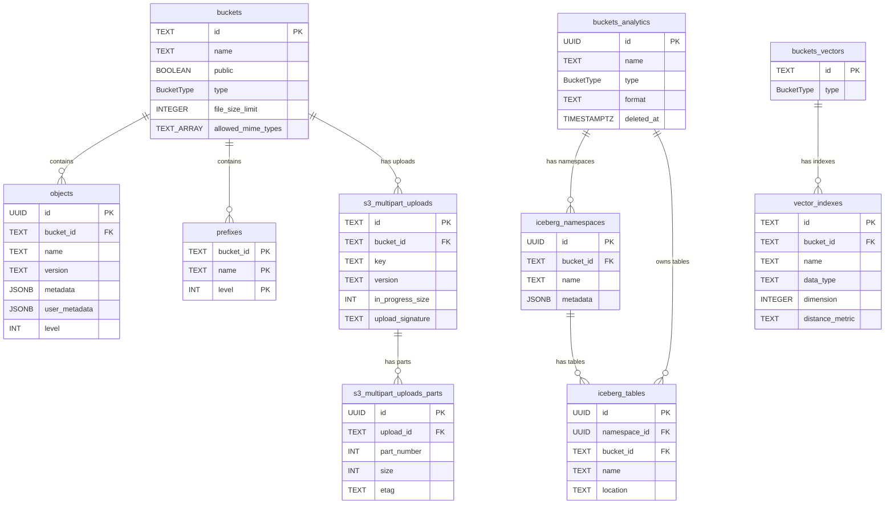

## Overview

Storage uses Postgres as its metadata store under the `storage` schema. Actual file bytes live in an S3-compatible backend; Postgres holds metadata, paths, ownership, and access control. The schema is organized around three bucket types that map to distinct entity groups → `sources/context/decisions/storage-overview.md`:

- **Files buckets** (STANDARD): `buckets` + `objects` + `prefixes` + `s3_multipart_uploads`/`s3_multipart_uploads_parts` — traditional file storage with CDN and image optimization
- **Analytics buckets** (ANALYTICS): `buckets_analytics` + `iceberg_namespaces` + `iceberg_tables` — Apache Iceberg table format for data lakes, SQL-accessible via Postgres foreign tables
- **Vector buckets** (VECTOR): `buckets_vectors` + `vector_indexes` — vector embeddings with HNSW/Flat indexing and similarity search

RLS is enabled on all tables. The database layer is accessed through a Knex query builder with transaction support, role switching (`asSuperUser`), and migration-aware feature gating.

## Key Facts

- All tables live in the `storage` Postgres schema; the `BucketType` enum has three values: STANDARD, ANALYTICS, VECTOR -> `migrations/tenant/0038-iceberg-catalog-flag-on-buckets.sql`, `migrations/tenant/0044-vector-bucket-type.sql`
- Database layer implements the `Database` interface via `StorageKnexDB` using Knex with transaction support and `asSuperUser()` role elevation -> `src/storage/database/knex.ts`
- The `prefixes` table is auto-maintained by triggers: `objects_insert_create_prefix` fires BEFORE INSERT on objects to populate ancestor prefixes, and `objects_delete_delete_prefix` fires AFTER DELETE to clean up -> `migrations/tenant/0026-objects-prefixes.sql`
- The `prefixes` PK is composite `(bucket_id, level, name)` where `level` is a generated column from `get_level(name)` counting path segments -> `migrations/tenant/0026-objects-prefixes.sql`
- Direct DELETE on `buckets` and `objects` tables is blocked by a `protect_delete` trigger unless `storage.allow_delete_query` is set to 'true' -- prevents orphaned S3 objects -> `migrations/tenant/0055-prevent-direct-deletes.sql`
- S3 multipart uploads use two tables: `s3_multipart_uploads` tracks the upload session with `upload_signature` and `in_progress_size`, while `s3_multipart_uploads_parts` tracks individual parts with `etag` and `part_number` (CASCADE on delete) -> `migrations/tenant/0021-s3-multipart-uploads.sql`
- Objects use `COLLATE "C"` on the `name` column for byte-order sorting, matching S3 lexicographic ordering semantics -> `sources/schemas/storage/schema.md`
- The `objects` table has both `metadata` (system, e.g. size/mimetype from S3 HEAD) and `user_metadata` (custom, set by client) as separate JSONB columns -> `src/storage/schemas/object.ts`
- `buckets_analytics` is a separate table from `buckets` with its own PK; Iceberg namespaces and tables reference it via FK, not the main `buckets` table -> `migrations/tenant/0038-iceberg-catalog-flag-on-buckets.sql`
- `buckets_analytics` supports soft deletes via a `deleted_at` column; queries filter `WHERE deleted_at IS NULL` -> `src/storage/database/knex.ts`
- Vector indexes store `data_type`, `dimension`, and `distance_metric` with a unique constraint on `(name, bucket_id)` -> `migrations/tenant/0045-vector-buckets.sql`
- Migration path has 58 tenant migrations (0001 through 0058); multitenant deployments have a separate migration directory -> `migrations/tenant/`, `migrations/multitenant/`
- The three bucket types correspond to specialized entity groups: Files buckets use `buckets`/`objects`/`prefixes`, Analytics buckets use `buckets_analytics`/`iceberg_namespaces`/`iceberg_tables`, Vector buckets use `buckets_vectors`/`vector_indexes` → `sources/context/decisions/storage-overview.md`
- Analytics buckets are purpose-built for data lakes with Apache Iceberg format; data is SQL-accessible via Postgres foreign tables → `sources/context/decisions/storage-overview.md`
- Vector buckets support HNSW and Flat index types with cosine, euclidean, and L2 distance metrics for AI/ML similarity search → `sources/context/decisions/storage-overview.md`
- The `Database` interface exposes `testPermission()` which runs a query inside a transaction that always rolls back -- used to check RLS permissions without side effects -> `src/storage/database/knex.ts`

## Entities

### buckets

Core container entity. Each bucket has visibility settings and optional upload constraints.

| Column | Type | Constraints | Notes |
|--------|------|-------------|-------|
| id | TEXT | PK | User-defined identifier |
| name | TEXT | NOT NULL, UNIQUE | Display name |
| owner | UUID | NULLABLE | Deprecated in favor of owner_id |
| owner_id | TEXT | NULLABLE | Current owner reference |
| public | BOOLEAN | default: false | Controls unauthenticated access |
| type | BucketType | NOT NULL, default: STANDARD | STANDARD, ANALYTICS, or VECTOR |
| file_size_limit | INTEGER | NULLABLE | Max upload size in bytes |
| allowed_mime_types | TEXT[] | NULLABLE | Whitelist of content types |
| created_at | TIMESTAMPTZ | default: now() | |
| updated_at | TIMESTAMPTZ | default: now() | |

### objects

File metadata records. Actual bytes stored in S3 backend.

| Column | Type | Constraints | Notes |
|--------|------|-------------|-------|
| id | UUID | PK, default: gen_random_uuid() | |
| bucket_id | TEXT | FK -> buckets.id | |
| name | TEXT | COLLATE "C" | Full path including folders |
| owner | UUID | NULLABLE | Deprecated |
| owner_id | TEXT | NULLABLE | Current owner |
| version | TEXT | | Object version UUID |
| metadata | JSONB | NULLABLE | System metadata (size, mimetype) |
| user_metadata | JSONB | NULLABLE | Client-supplied metadata |
| level | INT | GENERATED | Path depth from get_level() |
| created_at | TIMESTAMPTZ | default: now() | |
| updated_at | TIMESTAMPTZ | default: now() | |
| last_accessed_at | TIMESTAMPTZ | default: now() | |

UNIQUE: `(bucket_id, name)`. RLS enabled. Protected from direct DELETE.

### prefixes

Materialized prefix hierarchy, auto-maintained by triggers on the objects table.

| Column | Type | Constraints | Notes |
|--------|------|-------------|-------|
| bucket_id | TEXT | PK (composite), FK -> buckets.id | |
| name | TEXT | PK (composite), COLLATE "C" | Folder path without trailing / |
| level | INT | PK (composite), GENERATED ALWAYS | From get_level(name) |
| created_at | TIMESTAMPTZ | default: now() | |
| updated_at | TIMESTAMPTZ | default: now() | |

RLS enabled.

### s3_multipart_uploads

Tracks in-progress S3 multipart upload sessions.

| Column | Type | Constraints | Notes |
|--------|------|-------------|-------|
| id | TEXT | PK | Upload session identifier |
| in_progress_size | INT | NOT NULL, default: 0 | Bytes uploaded so far |
| upload_signature | TEXT | NOT NULL | Signature for validation |
| bucket_id | TEXT | FK -> buckets.id | |
| key | TEXT | COLLATE "C", NOT NULL | Target object path |
| version | TEXT | NOT NULL | Target object version |
| owner_id | TEXT | NULLABLE | |
| metadata | JSONB | NULLABLE | System metadata |
| user_metadata | JSONB | NULLABLE | Client metadata |
| created_at | TIMESTAMPTZ | NOT NULL, default: now() | |

RLS enabled.

### s3_multipart_uploads_parts

Individual parts of a multipart upload.

| Column | Type | Constraints | Notes |
|--------|------|-------------|-------|
| id | UUID | PK, default: gen_random_uuid() | |
| upload_id | TEXT | FK -> s3_multipart_uploads.id, CASCADE | |
| size | INT | NOT NULL, default: 0 | Part size in bytes |
| part_number | INT | NOT NULL | Ordered part index |
| bucket_id | TEXT | FK -> buckets.id | |
| key | TEXT | COLLATE "C", NOT NULL | |
| etag | TEXT | NOT NULL | Content hash |
| owner_id | TEXT | NULLABLE | |
| version | TEXT | NOT NULL | |
| created_at | TIMESTAMPTZ | NOT NULL, default: now() | |

RLS enabled.

### buckets_analytics

Iceberg catalog buckets, separate from standard buckets. Supports soft delete.

| Column | Type | Constraints | Notes |
|--------|------|-------------|-------|
| id | UUID | PK, default: gen_random_uuid() | |
| name | TEXT | UNIQUE where deleted_at IS NULL | |
| type | BucketType | NOT NULL, default: ANALYTICS | |
| format | TEXT | NOT NULL, default: ICEBERG | |
| deleted_at | TIMESTAMPTZ | NULLABLE | Soft delete marker |
| created_at | TIMESTAMPTZ | NOT NULL, default: now() | |
| updated_at | TIMESTAMPTZ | NOT NULL, default: now() | |

RLS enabled.

### iceberg_namespaces

| Column | Type | Constraints | Notes |
|--------|------|-------------|-------|
| id | UUID | PK, default: gen_random_uuid() | |
| bucket_id | TEXT | FK -> buckets_analytics.id, CASCADE | |
| catalog_id | UUID | FK -> buckets_analytics.id, NULLABLE | Added in migration 0048 |
| name | TEXT | COLLATE "C", NOT NULL | |
| metadata | JSONB | NOT NULL, default: {} | Namespace properties |
| created_at | TIMESTAMPTZ | NOT NULL, default: now() | |
| updated_at | TIMESTAMPTZ | NOT NULL, default: now() | |

UNIQUE: `(bucket_id, name)`. RLS enabled.

### iceberg_tables

| Column | Type | Constraints | Notes |
|--------|------|-------------|-------|
| id | UUID | PK, default: gen_random_uuid() | |
| namespace_id | UUID | FK -> iceberg_namespaces.id, CASCADE | |
| bucket_id | TEXT | FK -> buckets_analytics.id, CASCADE | |
| catalog_id | UUID | FK -> buckets_analytics.id, NULLABLE | |
| name | TEXT | COLLATE "C", NOT NULL | |
| location | TEXT | NOT NULL | S3 path to table data |
| remote_table_id | TEXT | NULLABLE | External reference |
| shard_key | TEXT | NULLABLE | For distributed queries |
| shard_id | TEXT | NULLABLE | |
| created_at | TIMESTAMPTZ | NOT NULL, default: now() | |
| updated_at | TIMESTAMPTZ | NOT NULL, default: now() | |

UNIQUE: `(namespace_id, name)`. RLS enabled.

### buckets_vectors

| Column | Type | Constraints | Notes |
|--------|------|-------------|-------|
| id | TEXT | PK | |
| type | BucketType | NOT NULL, default: VECTOR | |
| created_at | TIMESTAMPTZ | NOT NULL, default: now() | |
| updated_at | TIMESTAMPTZ | NOT NULL, default: now() | |

RLS enabled.

### vector_indexes

| Column | Type | Constraints | Notes |
|--------|------|-------------|-------|
| id | TEXT | PK, default: gen_random_uuid() | |
| name | TEXT | COLLATE "C", NOT NULL | |
| bucket_id | TEXT | FK -> buckets_vectors.id | |
| data_type | TEXT | NOT NULL | e.g. float32 |
| dimension | INTEGER | NOT NULL | Vector dimensionality |
| distance_metric | TEXT | NOT NULL | e.g. cosine, euclidean |
| metadata_configuration | JSONB | NULLABLE | nonFilterableMetadataKeys |
| created_at | TIMESTAMPTZ | NOT NULL, default: now() | |
| updated_at | TIMESTAMPTZ | NOT NULL, default: now() | |

UNIQUE: `(name, bucket_id)`. RLS enabled.

### migrations

Internal migration tracking table.

| Column | Type | Constraints |
|--------|------|-------------|
| id | INTEGER | PK |
| name | VARCHAR(100) | UNIQUE, NOT NULL |
| hash | VARCHAR(40) | NOT NULL |
| executed_at | TIMESTAMP | default: current_timestamp |

## ER Diagram

## Worked Examples

### Upload creates prefix hierarchy

When an object `photos/vacation/2024/beach.jpg` is inserted into bucket `mybucket`:

1. The `objects_insert_create_prefix` trigger fires BEFORE INSERT
2. `get_prefixes('photos/vacation/2024/beach.jpg')` returns `['photos', 'photos/vacation', 'photos/vacation/2024']`
3. Three rows are INSERT ... ON CONFLICT DO NOTHING into `prefixes` with `bucket_id = 'mybucket'`
4. The object's `level` column is set to `4` (four path segments)

When `beach.jpg` is the last object under `photos/vacation/2024/`, deleting it triggers `delete_prefix_hierarchy_trigger` which attempts to remove `photos/vacation/2024` from prefixes, then cascades upward if parent prefixes also become empty.

### Multipart upload lifecycle in the database

1. `createMultipartUpload` inserts a row into `s3_multipart_uploads` with `in_progress_size = 0`
2. Each `uploadPart` inserts into `s3_multipart_uploads_parts` with the part's `etag`, `size`, and `part_number`
3. `updateMultipartUploadProgress` increments `in_progress_size` as parts complete
4. `completeMultipartUpload` reads all parts, then deletes the upload row (CASCADE removes parts)
5. `abortMultipartUpload` simply deletes the upload row (CASCADE cleans up parts)

## Related

- [[SYS-STORAGE]] -- parent system
- [[API-STORAGE]] -- API endpoints that operate on this schema
