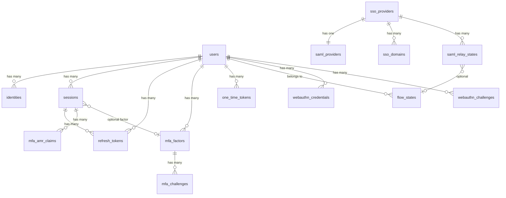

# Schema -- Auth

> Extracted by reading Go model source code directly (tier 4). Computed fields, dynamic relationships, or migration-only columns may be missing.

## Tables

### users
| Column | Type | Constraints |
|--------|------|-------------|
| id | UUID | PK |
| aud | VARCHAR | NOT NULL |
| role | VARCHAR | NOT NULL |
| email | VARCHAR | NULLABLE |
| is_sso_user | BOOLEAN | NOT NULL |
| encrypted_password | VARCHAR | NULLABLE |
| email_confirmed_at | TIMESTAMPTZ | NULLABLE |
| invited_at | TIMESTAMPTZ | NULLABLE |
| phone | VARCHAR | NULLABLE |
| phone_confirmed_at | TIMESTAMPTZ | NULLABLE |
| confirmation_token | VARCHAR | |
| confirmation_sent_at | TIMESTAMPTZ | NULLABLE |
| confirmed_at | TIMESTAMPTZ | NULLABLE, read-only |
| recovery_token | VARCHAR | |
| recovery_sent_at | TIMESTAMPTZ | NULLABLE |
| email_change_token_current | VARCHAR | |
| email_change_token_new | VARCHAR | |
| email_change | VARCHAR | |
| email_change_sent_at | TIMESTAMPTZ | NULLABLE |
| email_change_confirm_status | INT | |
| phone_change_token | VARCHAR | |
| phone_change | VARCHAR | |
| phone_change_sent_at | TIMESTAMPTZ | NULLABLE |
| reauthentication_token | VARCHAR | |
| reauthentication_sent_at | TIMESTAMPTZ | NULLABLE |
| last_sign_in_at | TIMESTAMPTZ | NULLABLE |
| raw_app_meta_data | JSONB | |
| raw_user_meta_data | JSONB | |
| created_at | TIMESTAMPTZ | NOT NULL |
| updated_at | TIMESTAMPTZ | NOT NULL |
| banned_until | TIMESTAMPTZ | NULLABLE |
| deleted_at | TIMESTAMPTZ | NULLABLE |
| is_anonymous | BOOLEAN | NOT NULL |
| instance_id | UUID | deprecated |

### identities
| Column | Type | Constraints |
|--------|------|-------------|
| id | UUID | PK |
| provider_id | VARCHAR | NOT NULL |
| user_id | UUID | FK -> users.id |
| identity_data | JSONB | |
| provider | VARCHAR | NOT NULL |
| last_sign_in_at | TIMESTAMPTZ | NULLABLE |
| created_at | TIMESTAMPTZ | NOT NULL |
| updated_at | TIMESTAMPTZ | NOT NULL |
| email | VARCHAR | NULLABLE, read-only |

### sessions
| Column | Type | Constraints |
|--------|------|-------------|
| id | UUID | PK |
| user_id | UUID | FK -> users.id |
| not_after | TIMESTAMPTZ | NULLABLE |
| created_at | TIMESTAMPTZ | NOT NULL |
| updated_at | TIMESTAMPTZ | NOT NULL |
| factor_id | UUID | FK -> mfa_factors.id, NULLABLE |
| aal | VARCHAR | NULLABLE (aal1/aal2/aal3) |
| refreshed_at | TIMESTAMPTZ | NULLABLE |
| user_agent | VARCHAR | NULLABLE |
| ip | VARCHAR | NULLABLE |
| tag | VARCHAR | NULLABLE |
| oauth_client_id | UUID | NULLABLE |
| scopes | VARCHAR | NULLABLE |
| refresh_token_hmac_key | VARCHAR | NULLABLE |
| refresh_token_counter | BIGINT | NULLABLE |

### refresh_tokens
| Column | Type | Constraints |
|--------|------|-------------|
| id | BIGINT | PK |
| token | VARCHAR | NOT NULL |
| user_id | UUID | FK -> users.id |
| parent | VARCHAR | NULLABLE |
| session_id | UUID | FK -> sessions.id, NULLABLE |
| revoked | BOOLEAN | NOT NULL |
| created_at | TIMESTAMPTZ | NOT NULL |
| updated_at | TIMESTAMPTZ | NOT NULL |
| instance_id | UUID | deprecated |

### mfa_factors (factors)
| Column | Type | Constraints |
|--------|------|-------------|
| id | UUID | PK |
| user_id | UUID | FK -> users.id |
| created_at | TIMESTAMPTZ | NOT NULL |
| updated_at | TIMESTAMPTZ | NOT NULL |
| status | VARCHAR | NOT NULL (unverified/verified) |
| friendly_name | VARCHAR | NULLABLE |
| secret | VARCHAR | encrypted |
| factor_type | VARCHAR | NOT NULL (totp/phone/webauthn) |
| phone | VARCHAR | NULLABLE |
| last_challenged_at | TIMESTAMPTZ | NULLABLE |
| web_authn_credential | JSONB | NULLABLE |
| web_authn_aaguid | UUID | NULLABLE |
| last_webauthn_challenge_data | JSONB | NULLABLE |

### mfa_challenges (challenges)
| Column | Type | Constraints |
|--------|------|-------------|
| id | UUID | PK |
| factor_id | UUID | FK -> mfa_factors.id |
| created_at | TIMESTAMPTZ | NOT NULL |
| verified_at | TIMESTAMPTZ | NULLABLE |
| ip_address | VARCHAR | NOT NULL |
| otp_code | VARCHAR | |
| web_authn_session_data | JSONB | NULLABLE |

### mfa_amr_claims
| Column | Type | Constraints |
|--------|------|-------------|
| id | UUID | PK |
| session_id | UUID | FK -> sessions.id |
| created_at | TIMESTAMPTZ | NOT NULL |
| updated_at | TIMESTAMPTZ | NOT NULL |
| authentication_method | VARCHAR | NULLABLE |

### one_time_tokens
| Column | Type | Constraints |
|--------|------|-------------|
| id | UUID | PK |
| user_id | UUID | FK -> users.id |
| token_type | VARCHAR | NOT NULL |
| token_hash | VARCHAR | NOT NULL |
| relates_to | VARCHAR | NOT NULL |
| created_at | TIMESTAMPTZ | NOT NULL |
| updated_at | TIMESTAMPTZ | NOT NULL |

### flow_states
| Column | Type | Constraints |
|--------|------|-------------|
| id | UUID | PK |
| user_id | UUID | FK -> users.id, NULLABLE |
| auth_code | VARCHAR | NULLABLE |
| authentication_method | VARCHAR | NOT NULL |
| code_challenge | VARCHAR | NULLABLE |
| code_challenge_method | VARCHAR | NULLABLE |
| provider_type | VARCHAR | NOT NULL |
| provider_access_token | VARCHAR | NOT NULL |
| provider_refresh_token | VARCHAR | NOT NULL |
| auth_code_issued_at | TIMESTAMPTZ | NULLABLE |
| created_at | TIMESTAMPTZ | NOT NULL |
| updated_at | TIMESTAMPTZ | NOT NULL |
| invite_token | VARCHAR | NULLABLE |
| referrer | VARCHAR | NULLABLE |
| oauth_client_state_id | UUID | NULLABLE |
| linking_target_id | UUID | NULLABLE |
| email_optional | BOOLEAN | NOT NULL |

### audit_log_entries
| Column | Type | Constraints |
|--------|------|-------------|
| id | UUID | PK |
| payload | JSONB | NOT NULL |
| created_at | TIMESTAMPTZ | NOT NULL |
| ip_address | VARCHAR | NOT NULL |
| instance_id | UUID | deprecated |

### sso_providers
| Column | Type | Constraints |
|--------|------|-------------|
| id | UUID | PK |
| resource_id | VARCHAR | NULLABLE |
| disabled | BOOLEAN | NULLABLE |
| created_at | TIMESTAMPTZ | NOT NULL |
| updated_at | TIMESTAMPTZ | NOT NULL |

### saml_providers
| Column | Type | Constraints |
|--------|------|-------------|
| id | UUID | PK |
| sso_provider_id | UUID | FK -> sso_providers.id |
| entity_id | VARCHAR | NOT NULL |
| metadata_xml | TEXT | NOT NULL |
| metadata_url | VARCHAR | NULLABLE |
| attribute_mapping | JSONB | |
| name_id_format | VARCHAR | NULLABLE |
| created_at | TIMESTAMPTZ | NOT NULL |
| updated_at | TIMESTAMPTZ | NOT NULL |

### sso_domains
| Column | Type | Constraints |
|--------|------|-------------|
| id | UUID | PK |
| sso_provider_id | UUID | FK -> sso_providers.id |
| domain | VARCHAR | NOT NULL |
| created_at | TIMESTAMPTZ | NOT NULL |
| updated_at | TIMESTAMPTZ | NOT NULL |

### saml_relay_states
| Column | Type | Constraints |
|--------|------|-------------|
| id | UUID | PK |
| sso_provider_id | UUID | FK -> sso_providers.id |
| request_id | VARCHAR | NOT NULL |
| for_email | VARCHAR | NULLABLE |
| redirect_to | VARCHAR | NOT NULL |
| created_at | TIMESTAMPTZ | NOT NULL |
| updated_at | TIMESTAMPTZ | NOT NULL |
| flow_state_id | UUID | FK -> flow_states.id, NULLABLE |

### webauthn_credentials
| Column | Type | Constraints |
|--------|------|-------------|
| id | UUID | PK |
| user_id | UUID | FK -> users.id |
| credential_id | BYTEA | NOT NULL |
| public_key | BYTEA | NOT NULL |
| attestation_type | VARCHAR | NOT NULL |
| aaguid | UUID | NULLABLE |
| sign_count | INT | NOT NULL |
| transports | JSONB | |
| backup_eligible | BOOLEAN | NOT NULL |
| backed_up | BOOLEAN | NOT NULL |
| friendly_name | VARCHAR | NOT NULL |
| created_at | TIMESTAMPTZ | NOT NULL |
| updated_at | TIMESTAMPTZ | NOT NULL |
| last_used_at | TIMESTAMPTZ | NULLABLE |

### webauthn_challenges
| Column | Type | Constraints |
|--------|------|-------------|
| id | UUID | PK |
| user_id | UUID | FK -> users.id, NULLABLE |
| challenge_type | VARCHAR | NOT NULL |
| session_data | JSONB | |
| created_at | TIMESTAMPTZ | NOT NULL |
| expires_at | TIMESTAMPTZ | NOT NULL |

### custom_oauth_providers
| Column | Type | Constraints |
|--------|------|-------------|
| id | UUID | PK |
| provider_type | VARCHAR | NOT NULL (oauth2/oidc) |
| identifier | VARCHAR | NOT NULL, UNIQUE |
| name | VARCHAR | NOT NULL |
| client_id | VARCHAR | NOT NULL |
| client_secret | VARCHAR | encrypted |
| acceptable_client_ids | TEXT[] | NULLABLE |
| scopes | TEXT[] | NULLABLE |
| pkce_enabled | BOOLEAN | NOT NULL |
| attribute_mapping | JSONB | |
| authorization_params | JSONB | |
| enabled | BOOLEAN | NOT NULL |
| email_optional | BOOLEAN | NOT NULL |
| issuer | VARCHAR | NULLABLE (OIDC only) |
| discovery_url | VARCHAR | NULLABLE (OIDC only) |
| skip_nonce_check | BOOLEAN | NOT NULL |

## Relationships

