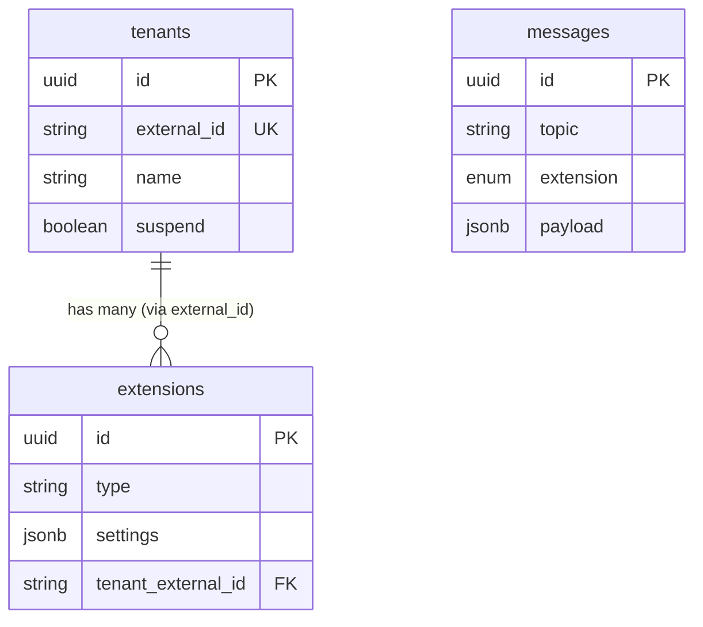

# Schema -- Realtime

> Extracted by reading Elixir/Ecto schema source code directly (tier 4). Computed fields, dynamic relationships, or migration-only columns may be missing.

## Tables

### tenants
| Column | Type | Constraints |
|--------|------|-------------|
| id | UUID | PK, autogenerate |
| name | VARCHAR | |
| external_id | VARCHAR | UNIQUE |
| jwt_secret | VARCHAR | encrypted |
| jwt_jwks | JSONB | NULLABLE |
| postgres_cdc_default | VARCHAR | |
| max_concurrent_users | INTEGER | |
| max_events_per_second | INTEGER | |
| max_presence_events_per_second | INTEGER | default: 1000 |
| max_payload_size_in_kb | INTEGER | default: 3000 |
| max_bytes_per_second | INTEGER | |
| max_channels_per_client | INTEGER | |
| max_joins_per_second | INTEGER | |
| suspend | BOOLEAN | default: false |
| private_only | BOOLEAN | default: false |
| migrations_ran | INTEGER | default: 0 |
| broadcast_adapter | ENUM | phoenix/gen_rpc, default: gen_rpc |
| max_client_presence_events_per_window | INTEGER | |
| client_presence_window_ms | INTEGER | |
| presence_enabled | BOOLEAN | default: false |
| inserted_at | TIMESTAMPTZ | auto |
| updated_at | TIMESTAMPTZ | auto |

### extensions
| Column | Type | Constraints |
|--------|------|-------------|
| id | UUID | PK, autogenerate |
| type | VARCHAR | NOT NULL |
| settings | JSONB | NOT NULL |
| tenant_external_id | VARCHAR | FK -> tenants.external_id |
| inserted_at | TIMESTAMPTZ | auto |
| updated_at | TIMESTAMPTZ | auto |

### messages (realtime schema)
| Column | Type | Constraints |
|--------|------|-------------|
| id | UUID | PK, autogenerate |
| topic | VARCHAR | NOT NULL |
| extension | ENUM | broadcast/presence, NOT NULL |
| payload | JSONB | |
| event | VARCHAR | |
| private | BOOLEAN | |
| inserted_at | TIMESTAMPTZ | auto (microsecond) |
| updated_at | TIMESTAMPTZ | auto (microsecond) |

## Relationships

