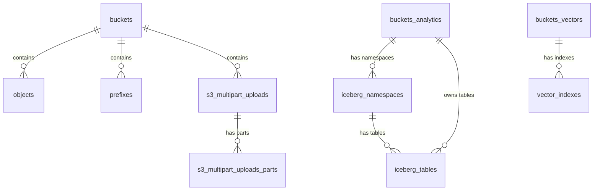

# Schema -- Storage

> Extracted by reading SQL migration files directly (tier 3). Source of truth: migrations/tenant/ directory with 50+ migration files.

## Tables

### buckets
| Column | Type | Constraints |
|--------|------|-------------|
| id | TEXT | PK |
| name | TEXT | NOT NULL, UNIQUE INDEX (bname) |
| owner | UUID | NULLABLE |
| public | BOOLEAN | default: false |
| type | BucketType ENUM | NOT NULL, default: STANDARD (STANDARD/ANALYTICS) |
| created_at | TIMESTAMPTZ | default: now() |
| updated_at | TIMESTAMPTZ | default: now() |

### objects
| Column | Type | Constraints |
|--------|------|-------------|
| id | UUID | PK, default: gen_random_uuid() |
| bucket_id | TEXT | FK -> buckets.id |
| name | TEXT | COLLATE "C" |
| owner | UUID | NULLABLE |
| metadata | JSONB | NULLABLE |
| user_metadata | JSONB | NULLABLE |
| level | INT | NULLABLE, generated |
| created_at | TIMESTAMPTZ | default: now() |
| updated_at | TIMESTAMPTZ | default: now() |
| last_accessed_at | TIMESTAMPTZ | default: now() |

UNIQUE INDEX: (bucket_id, name)
RLS: enabled

### prefixes
| Column | Type | Constraints |
|--------|------|-------------|
| bucket_id | TEXT | PK (composite), FK -> buckets.id |
| name | TEXT | PK (composite), COLLATE "C", NOT NULL |
| level | INT | PK (composite), GENERATED ALWAYS AS (get_level(name)) |
| created_at | TIMESTAMPTZ | default: now() |
| updated_at | TIMESTAMPTZ | default: now() |

RLS: enabled

### s3_multipart_uploads
| Column | Type | Constraints |
|--------|------|-------------|
| id | TEXT | PK |
| in_progress_size | INT | NOT NULL, default: 0 |
| upload_signature | TEXT | NOT NULL |
| bucket_id | TEXT | FK -> buckets.id |
| key | TEXT | COLLATE "C", NOT NULL |
| version | TEXT | NOT NULL |
| owner_id | TEXT | NULLABLE |
| metadata | JSONB | NULLABLE |
| user_metadata | JSONB | NULLABLE |
| created_at | TIMESTAMPTZ | NOT NULL, default: now() |

RLS: enabled

### s3_multipart_uploads_parts
| Column | Type | Constraints |
|--------|------|-------------|
| id | UUID | PK, default: gen_random_uuid() |
| upload_id | TEXT | FK -> s3_multipart_uploads.id ON DELETE CASCADE |
| size | INT | NOT NULL, default: 0 |
| part_number | INT | NOT NULL |
| bucket_id | TEXT | FK -> buckets.id |
| key | TEXT | COLLATE "C", NOT NULL |
| etag | TEXT | NOT NULL |
| owner_id | TEXT | NULLABLE |
| version | TEXT | NOT NULL |
| created_at | TIMESTAMPTZ | NOT NULL, default: now() |

RLS: enabled

### buckets_analytics
| Column | Type | Constraints |
|--------|------|-------------|
| id | UUID | PK, default: gen_random_uuid() |
| type | BucketType ENUM | NOT NULL, default: ANALYTICS |
| format | TEXT | NOT NULL, default: ICEBERG |
| deleted_at | TIMESTAMPTZ | NULLABLE |
| created_at | TIMESTAMPTZ | NOT NULL, default: now() |
| updated_at | TIMESTAMPTZ | NOT NULL, default: now() |

RLS: enabled

### iceberg_namespaces
| Column | Type | Constraints |
|--------|------|-------------|
| id | UUID | PK, default: gen_random_uuid() |
| bucket_id | TEXT | FK -> buckets_analytics.id ON DELETE CASCADE |
| catalog_id | UUID | FK -> buckets_analytics.id, NULLABLE |
| name | TEXT | COLLATE "C", NOT NULL |
| metadata | JSONB | NOT NULL, default: {} |
| created_at | TIMESTAMPTZ | NOT NULL, default: now() |
| updated_at | TIMESTAMPTZ | NOT NULL, default: now() |

UNIQUE INDEX: (bucket_id, name)
RLS: enabled

### iceberg_tables
| Column | Type | Constraints |
|--------|------|-------------|
| id | UUID | PK, default: gen_random_uuid() |
| namespace_id | UUID | FK -> iceberg_namespaces.id ON DELETE CASCADE |
| bucket_id | TEXT | FK -> buckets_analytics.id ON DELETE CASCADE |
| catalog_id | UUID | FK -> buckets_analytics.id, NULLABLE |
| name | TEXT | COLLATE "C", NOT NULL |
| location | TEXT | NOT NULL |
| remote_table_id | TEXT | NULLABLE |
| shard_key | TEXT | NULLABLE |
| shard_id | TEXT | NULLABLE |
| created_at | TIMESTAMPTZ | NOT NULL, default: now() |
| updated_at | TIMESTAMPTZ | NOT NULL, default: now() |

UNIQUE INDEX: (namespace_id, name)
RLS: enabled

### buckets_vectors
| Column | Type | Constraints |
|--------|------|-------------|
| id | TEXT | PK |
| type | BucketType ENUM | NOT NULL, default: VECTOR |
| created_at | TIMESTAMPTZ | NOT NULL, default: now() |
| updated_at | TIMESTAMPTZ | NOT NULL, default: now() |

RLS: enabled

### vector_indexes
| Column | Type | Constraints |
|--------|------|-------------|
| id | TEXT | PK, default: gen_random_uuid() |
| name | TEXT | COLLATE "C", NOT NULL |
| bucket_id | TEXT | FK -> buckets_vectors.id |
| data_type | TEXT | NOT NULL |
| dimension | INTEGER | NOT NULL |
| distance_metric | TEXT | NOT NULL |
| metadata_configuration | JSONB | NULLABLE |
| created_at | TIMESTAMPTZ | NOT NULL, default: now() |
| updated_at | TIMESTAMPTZ | NOT NULL, default: now() |

UNIQUE INDEX: (name, bucket_id)
RLS: enabled

### migrations
| Column | Type | Constraints |
|--------|------|-------------|
| id | INTEGER | PK |
| name | VARCHAR(100) | UNIQUE, NOT NULL |
| hash | VARCHAR(40) | NOT NULL |
| executed_at | TIMESTAMP | default: current_timestamp |

## Relationships

